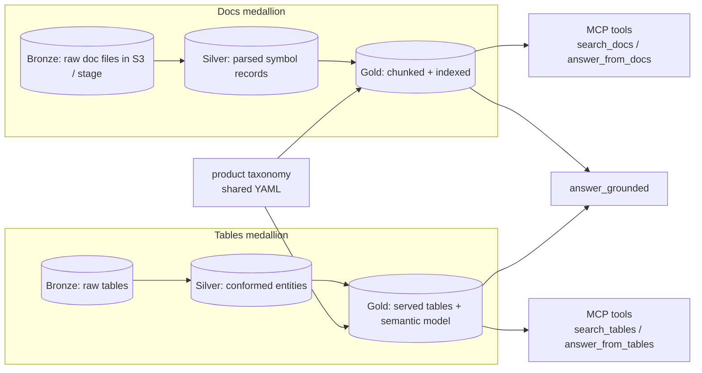

# 4. Medallion structure for codebase docs and Snowflake table context

This chapter applies the bronze / silver / gold medallion structure
to **both** surfaces — codebase-generated documentation and
Snowflake-resident business tables — and pins down the contract
between them.

## 4.1 Why medallion at all

The medallion structure gives us three useful properties:

1. **Re-runnable ingestion.** If anything downstream is wrong, you
   can rebuild it from the raw bronze layer without re-touching the
   source systems.
2. **Schema evolution.** Bronze tolerates schema change; silver is
   the place where you reconcile it; gold is what consumers see. The
   downstream contract (gold) stays stable while sources change.
3. **Auditability.** Each row at gold has lineage back to a
   bronze row; each indexed chunk has lineage back to a gold row.

The redesign treats *docs* and *tables* as two parallel medallions
that meet at a shared `product` taxonomy. Either side can evolve
independently; the gold layer of each is what the MCP tools serve.

## 4.2 Codebase-docs medallion

### 4.2.1 Bronze — raw

- **Source.** The (separate) doc-generation pipeline that runs in
  each product's CI on every commit to its main branch. Output is
  a tree of Markdown / AsciiDoc / HTML files under a product-prefixed
  prefix.
- **Location.** S3 (AWS designs) or a Snowflake **internal stage**
  (Snowflake designs) or both (hybrid).
- **Layout.**

  ```
  s3://org-rag-bronze/docs/product=<product>/commit=<sha>/<path>
  ```

  `<sha>` is the source-tree commit; doc files are immutable per
  commit. The lifecycle policy keeps the last N commits and the
  pinned `latest/` pointer.

- **What we do** at this layer: nothing transformative. Store as-is.

### 4.2.2 Silver — parsed and normalised

- **Source.** Bronze.
- **Transformations.**
  - Parse Markdown / AsciiDoc / HTML to a structured representation
    (front-matter, sections, code blocks, parameter tables,
    examples).
  - Strip navigation/chrome.
  - Resolve cross-references (e.g., `[[OtherSymbol]]`) into
    fully-qualified symbol references.
  - Extract per-symbol structured records: module, symbol kind,
    signature, parameters, returns, raises, examples, narrative.
  - Detect duplicate sections (boilerplate "Installation"
    paragraphs across products) and tag them so they can be
    deboosted at retrieval.
- **Output table** (logical; the physical store depends on the
  design):

  ```
  silver.docs.symbols
    symbol_id (uuid pk)
    product
    repo
    commit_sha
    path
    module
    symbol
    symbol_kind     (function|class|struct|module|page)
    signature
    description     (markdown)
    parameters      (struct[])
    returns         (struct)
    examples        (struct[])
    raises          (struct[])
    language
    last_modified
    extracted_at
    checksum
  ```

  In AWS designs, this is one or more Parquet datasets in S3
  registered in Glue. In Snowflake designs, this is a table in
  `<DB>.SILVER.DOCS_SYMBOLS`. In hybrid, AWS-side is canonical and
  Snowflake reads from a Snowflake external table over the same
  S3 prefix if cross-medallion joins are required.

### 4.2.3 Gold — chunked and indexed

- **Source.** Silver.
- **Transformation.** Apply the hierarchical chunking described in
  §3.2.3:
  - One *parent* chunk per `symbol_id`.
  - N *child* chunks per parent, one per paragraph / code example.
- **Output rows have the metadata schema in §3.4.1.** Each row
  becomes one entry in the vector index.
- **In AWS designs**, the gold layer is materialised as JSON files
  on S3 that Bedrock KB ingests, **and** the same rows are written
  to a `gold.docs.chunks` table for traceability.
- **In Snowflake designs**, the gold layer is the
  `<DB>.GOLD.DOCS_CHUNKS` table over which Cortex Search is
  defined.

### 4.2.4 Re-index trigger

A new commit on a product's main branch triggers:

```
bronze upload (CI side, out of scope)
   → silver parse (Glue/Lambda/Snowflake task, design-specific)
       → gold chunk (idempotent on (product, commit_sha))
           → vector index upsert (idempotent on chunk_id)
```

Idempotency is mandatory at every step: re-running silver →
gold → upsert on an unchanged commit must produce zero writes.

## 4.3 Snowflake-table medallion

### 4.3.1 Bronze — raw tables

- The org's existing raw-ingest tables in Snowflake. The RAG
  backend does not own them; it consumes them read-only.
- Typically: ingested CDC streams, raw event tables, files landed
  via Snowpipe.

### 4.3.2 Silver — conformed business entities

- Modelled, joined, deduplicated business entities.
- Owned by the data team, not by the RAG backend.
- Read by the RAG backend only for documentation purposes
  (descriptions, lineage), not for direct user-facing answers.

### 4.3.3 Gold — served

- The user-facing analytical layer: wide tables, semantic views,
  or aggregates ready to be queried.
- **This is the only layer the RAG backend serves to end users.**
- For each product, gold tables are listed in a per-product
  catalogue (a small YAML in this repo or a Snowflake table; the
  catalogue feeds into the semantic-model file Cortex Analyst
  uses).

### 4.3.4 Why not serve bronze or silver to end users?

- Bronze contains raw, unconformed shape — text-to-SQL over it
  produces wrong answers because schema is unstable.
- Silver is a private representation owned by the data team.
- Gold is by definition the place where analytical answers come
  from. Aligning the RAG-on-tables surface to gold matches the
  org's existing analytical-query expectations.

There is **one explicit exception**: the *description* of silver
tables (their docstrings, ownership, lineage) is allowed into the
gold layer of the *docs* medallion. That is how the
`search_tables` tool can return a result like "the silver table
`SILVER.ORDERS` feeds the gold table `GOLD.ORDERS_DAILY`" — the
gold *docs* surface knows about silver, even though the gold
*tables* surface does not expose silver rows to end users.

## 4.4 The cross-medallion contract

The two medallions are joined by `product` and, where applicable,
`module` / `business_entity` taxonomies. Concretely:



The contract:

- **Shared `product` enum.** Both sides reference the same product
  identifiers. A new product is added by writing a row in the
  taxonomy YAML, then re-running ingestion on both sides; nothing
  schema-level needs to change.
- **Shared identifier shape.** Docs cite `(product, commit_sha,
  path, span)`; tables cite `(product, table_fqn, query_id)`. The
  `answer_grounded` tool returns both in the same `citations[]`
  array, distinguished by a `kind` field.
- **One direction of dependency.** Docs can reference tables (by
  `table_fqn` in `RELATED_TABLES` front-matter); tables do not
  reference docs. This avoids ingestion cycles.

## 4.5 Re-ingestion strategy

Per medallion:

- **Docs medallion** re-ingests *per commit*. Cost is bounded by
  the number of changed files per commit; idempotency stops
  re-indexing of unchanged chunks.
- **Tables medallion** re-indexes *descriptions* on a daily cadence
  (or on schema change). Row data is not indexed — it's queried
  live via Cortex Analyst / Bedrock structured KB.

Reorganisations (renames, splits) are versioned at silver. A symbol
rename produces both an old-`symbol_id` deprecated row and a
new-`symbol_id` active row; retrieval pre-filters on `is_active`.
This avoids hard deletes from the vector index and keeps citations
to historic answers reproducible.

## 4.6 Ownership

| Layer | Docs medallion owner | Tables medallion owner |
|---|---|---|
| Bronze | Product team (via their CI doc pipeline). | Data engineering. |
| Silver | RAG backend team. | Data engineering. |
| Gold | RAG backend team. | Data engineering + product analytics. |
| MCP serving | RAG backend team. | RAG backend team (Cortex Analyst config) + data engineering (gold tables). |

## 4.7 Why we use all three layers

The user asked whether all three layers should be considered. The
explicit answer:

- **Bronze** matters because it is the only source-of-truth that
  preserves what the upstream system actually produced. Without
  bronze, re-runs are impossible.
- **Silver** matters because parsing/normalisation logic changes
  more often than the source. Silver is the place where bug fixes
  in parsing logic apply, *without* having to re-trigger upstream
  systems.
- **Gold** matters because it is the only layer the serving plane
  consumes. Keeping a clean gold surface means the MCP tools'
  shape is decoupled from the messy reality of bronze/silver
  evolution.

Skipping bronze (going straight to indexed gold) is a common early
shortcut. It bites the first time the parser changes — the team
has to coordinate with every doc-generation pipeline to re-run.
Bronze pays for itself the first time this happens.
