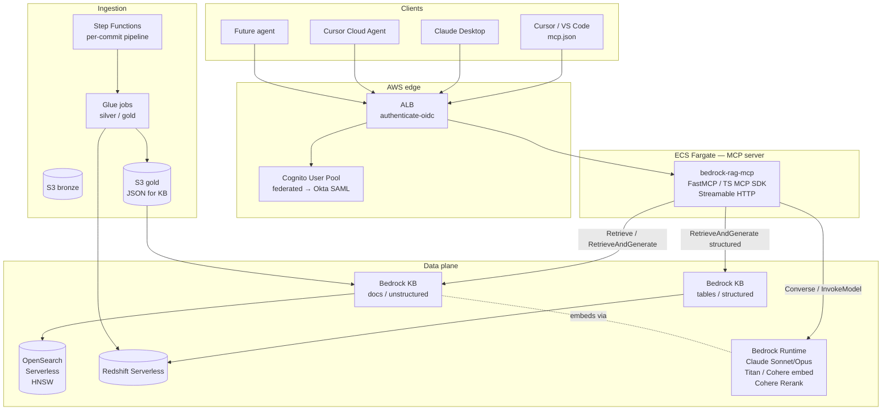
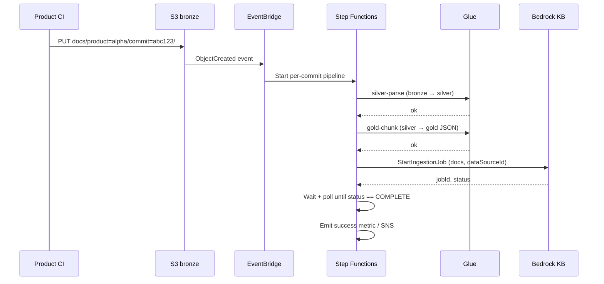
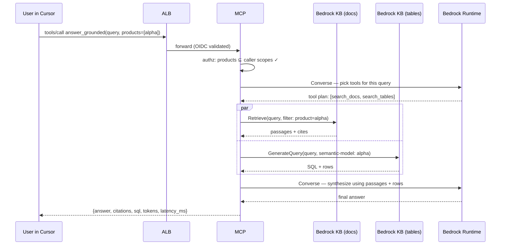

# 5. Design A — AWS managed

Bedrock Knowledge Bases + Bedrock Runtime + a custom MCP server on
Fargate. The smallest delta from the existing prototype while
delivering the new interface contract.

## 5.1 Reference architecture



## 5.2 Components

### 5.2.1 Serving plane

- **ALB** with `authenticate-oidc` action, fronting the MCP server.
  Internet-facing only via Cloudflare or a VPN-only listener,
  depending on org policy.
- **Cognito User Pool**, federated to Okta SAML. Cognito is the
  OAuth 2.1 server for the MCP endpoint. Hosted UI configured for
  the Okta IdP.
- **ECS Fargate service** running `bedrock-rag-mcp` (Python with
  FastMCP, or TypeScript with the official MCP SDK). One or more
  tasks behind the ALB. Streamable HTTP transport on a single
  HTTPS port.
- **Bedrock Runtime** for embeddings (Titan v2 / Cohere Embed v3),
  generation (Claude Sonnet/Opus), and reranking (Cohere Rerank).

### 5.2.2 Data plane

- **Bedrock KB — docs** (unstructured). Backed by OpenSearch
  Serverless. Embedding model pinned to Titan v2 or Cohere v3.
  Hierarchical chunking enabled (parent ~ symbol, child ~
  paragraph) — Bedrock KB exposes hierarchical chunking as a
  built-in mode.
- **Bedrock KB — tables** (structured). Query engine: Redshift
  Serverless. Data store: Redshift tables that mirror the gold
  Snowflake tables (replicated via the pipeline described in §5.4)
  or are produced natively in Redshift if the org is dual-warehoused.
  Per the verified docs: this is the supported structured-KB shape;
  Snowflake is not a supported direct source today, hence the
  replication step.
- **OpenSearch Serverless** vector collection, configured by
  Bedrock KB. HNSW index, default tuning.

### 5.2.3 Ingestion plane

- **S3 bronze bucket** `org-rag-bronze` partitioned by
  `product=<>/commit=<sha>/...`. Lifecycle: keep last N commits
  + `latest/` pointer.
- **S3 gold bucket** `org-rag-gold` with the chunked JSON Bedrock
  KB ingests.
- **Glue jobs** (Python shell or Spark) for silver and gold
  transformations.
- **Step Functions** state machine orchestrates per-commit
  ingestion: detect new bronze prefix → silver → gold → KB
  ingestion start.
- **Redshift Serverless** for the structured KB data plane (table
  metadata + replicated gold tables).

### 5.2.4 Observability

- **CloudWatch Logs** for the MCP service + structured per-tool
  events.
- **CloudWatch Logs Insights** queries committed to the repo.
- **AWS X-Ray** traces from MCP server through to Bedrock and
  Redshift.

## 5.3 IAM / RBAC / policies

### 5.3.1 Roles

- `RagMcpServiceRole` (ECS task role): permissions to call
  `bedrock:Retrieve*`, `bedrock:Converse`, `bedrock:InvokeModel`,
  `bedrock:GenerateQuery`, plus `redshift-data:ExecuteStatement` if
  the structured KB path is implemented directly, plus the
  AssumeRole permission to do `AssumeRoleWithWebIdentity` against
  per-user OIDC tokens.
- `RagBedrockKbRole` (used by Bedrock KB itself): read S3 bronze
  + write S3 gold, read OpenSearch Serverless, read Redshift.
- `RagGlueJobRole`: read bronze, write silver/gold.
- `RagStepFunctionsRole`: orchestrate the above.

### 5.3.2 Authentication chain

```
User in Cursor / VSCode / Claude Desktop
  → Okta SSO
  → Cognito Hosted UI (SAML federation)
  → Cognito issues OAuth 2.1 access token (audience = MCP server)
  → ALB validates token (authenticate-oidc)
  → MCP server validates audience + signature itself
  → MCP server does AssumeRoleWithWebIdentity using the user's
    Cognito-issued ID token
  → Resulting short-lived AWS credentials are used to call Bedrock
    + Redshift on the user's behalf
```

The per-call assume role is what propagates user identity all the
way to CloudTrail.

### 5.3.3 Multi-product authorisation

- Cognito groups one-per-product: `rag-product-alpha`,
  `rag-product-beta`, …
- Group membership maps to scope claims in the access token.
- The MCP server filters `products` parameters on every tool call
  against the caller's scopes.
- Bedrock KB pre-filter (`retrievalConfiguration.filter`) enforces
  `product IN <authorised set>` at the data layer as
  defence-in-depth.

### 5.3.4 Per-data-source ACLs

`acl_tags` in the chunk metadata (§3.4.1) enforce row-level
visibility. Bedrock KB's metadata-filter expression supports
`stringContainsAny(acl_tags, [<caller's tags>])`.

## 5.4 Snowflake table integration (in this design)

The MCP tool contract requires `search_tables` and
`answer_from_tables`. In an AWS-only design, this means *making the
gold tables visible to AWS-side services*:

Two viable paths:

- **Path 1: Replicate to Redshift.** A nightly (or hourly) Snowflake
  → S3 unload of gold tables (using `COPY INTO @stage`), followed
  by `COPY` into Redshift. The structured Bedrock KB pointed at
  Redshift uses these tables. Pros: native Bedrock structured KB
  support; pros: no live cross-cloud calls at query time. Cons:
  latency floor of the replication cadence; cost of two warehouses.
- **Path 2: Federate to Snowflake via Athena.** Athena's
  Snowflake-federated-query connector (a Lambda) lets Athena issue
  SQL into Snowflake. The MCP server then exposes a custom
  `answer_from_tables` that:
  1. Uses Bedrock + the semantic-model file to generate SQL.
  2. Executes via Athena → Snowflake.
  3. Returns rows + citations. Pros: no replication; one source
  of truth. Cons: each query traverses a cross-account path;
  the structured-KB feature is not used directly (custom code
  builds it).

For Design A as written, **Path 1 is the default** because it stays
inside Bedrock's managed structured-KB feature. Path 2 is the
fallback for orgs that forbid replication; in practice it's the
hybrid design (E) in disguise — see chapter 9.

## 5.5 Ingestion flow (a commit lands)



A separate scheduled Step Functions runs the table-medallion
replication for Path 1.

## 5.6 Serving flow (a question end-to-end)



## 5.7 Pros and cons

**Pros**

- Reuses the team's existing Bedrock + boto3 muscle.
- Bedrock KB hierarchical chunking + managed OpenSearch Serverless
  + Bedrock Rerank cover the RAG basics with minimal code.
- Bedrock structured KB gives a built-in text-to-SQL path.
- Identity end-to-end via Cognito + `AssumeRoleWithWebIdentity` is
  well-trodden.

**Cons**

- Snowflake table data is not first-class — requires Path 1
  replication or pivoting to Design E.
- Bedrock structured KB's NL→SQL ranges over Redshift / Glue, not
  Snowflake; the gold tables in Snowflake must be mirrored.
- Bedrock KB is opinionated about chunking; semantic-model
  customisation lives outside it (in the structured KB curated
  queries + table descriptions).
- A managed vector store costs more than self-managed at very
  large scales (not relevant for two products).

## 5.8 Build plan (by stage)

**Stage 1 — Foundations** (network, accounts, OIDC)

1. VPC, two private subnets, gateway and interface VPC endpoints
   for: `bedrock-runtime`, `bedrock-agent-runtime`, `ecr.api`,
   `ecr.dkr`, `logs`, `s3` (gateway), `secretsmanager`,
   `sts`.
2. Cognito User Pool + Okta SAML IdP wiring + groups
   (`rag-product-<id>` per product, `rag-operator`).
3. Okta admin: SAML app "RAG Backend" assigned to product groups.

**Stage 2 — Ingestion plane**

4. S3 bronze bucket with prefix layout + lifecycle.
5. S3 gold bucket.
6. Glue silver and gold jobs (idempotent, keyed by `commit_sha`).
7. Step Functions per-commit state machine + EventBridge rule.
8. Smoke-test bronze → silver → gold for product alpha and product
   beta.

**Stage 3 — Data plane**

9. OpenSearch Serverless collection (capacity units sized to the
   expected chunk count).
10. Bedrock KB (docs) pointing at S3 gold, with hierarchical
    chunking, Titan v2 or Cohere v3 embeddings, OpenSearch
    Serverless as storage.
11. Redshift Serverless workgroup + tables mirroring gold Snowflake
    tables (via Path 1 nightly unload + COPY).
12. Bedrock KB (tables, structured) pointing at Redshift; populate
    table/column descriptions, curated queries, inclusions.
13. End-to-end ingestion smoke test on a single product.

**Stage 4 — Serving plane**

14. ECS cluster, ECR repo, task definition for the MCP server.
15. MCP server implementation: tools from §2.1.1, FastMCP or TS MCP
    SDK, OAuth 2.1 token validation against Cognito.
16. ALB + `authenticate-oidc` listener rules in front of the
    service.
17. Cloudflare Access (optional) in front of the ALB for additional
    edge-side enforcement.

**Stage 5 — Hardening**

18. Per-tool structured logging + CloudWatch Insights queries.
19. Rate limiting per caller in the MCP server (token bucket per
    `sub`).
20. Cost budget + alerts.
21. End-to-end test with a real Cursor + a real VS Code instance
    consuming the MCP endpoint, exercising every tool and a
    `answer_grounded` query that spans docs and tables.

**Stage 6 — Onboarding** (per additional product)

22. Add product to the product-taxonomy YAML.
23. Update Cognito group → Okta group mapping.
24. Add product-specific table descriptions and curated queries to
    the structured KB.
25. Wait for first commit to land; verify ingestion runs end-to-end.

## 5.9 Failure modes

| Failure | Effect | Mitigation |
|---|---|---|
| Bedrock KB ingestion job stuck | Stale answers | Step Functions timeout + alert; manual restart is idempotent. |
| OpenSearch Serverless capacity exhausted | Slow retrieval | Capacity-unit alarm; pre-scaled to expected chunks × 2. |
| Bedrock model throttling | Slow / failed answers | Backoff + retry; cross-region inference profile; downgrade to a smaller model under budget pressure. |
| Replication lag on gold tables | Stale table answers | Lag metric exposed via `list_table_sources.last_indexed`. |
| Cognito IdP outage | No new sessions | Existing tokens valid for their lifetime; cached. |
| One product's ingestion failure | Other products keep working | Per-product Step Functions executions are isolated. |
