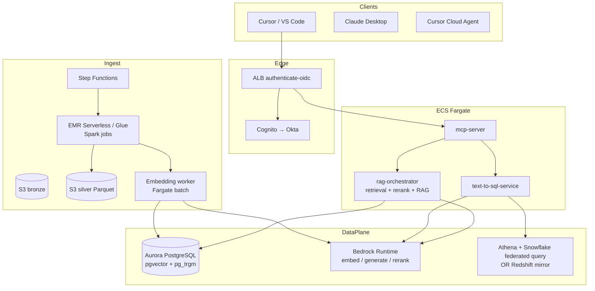

# 6. Design B — AWS self-managed

The same surface area as Design A, but without Bedrock Knowledge
Bases. The ingestion, vector store, retrieval orchestration, and
text-to-SQL are written by the team. Bedrock Runtime is still used
for LLM/embedding/rerank because writing those is not differentiating.

The point of this design is not "be cheaper than A." The point is
to capture every option B would have *if* the team wanted control
over the RAG plumbing — for example, a chunking strategy Bedrock KB
does not expose, a custom hybrid reranking pipeline, or a vector
store choice not in the Bedrock KB integration list.

## 6.1 Reference architecture



## 6.2 Components

### 6.2.1 Serving plane

Same as Design A: ALB + Cognito-Okta, ECS Fargate, MCP server.
Additionally:

- **rag-orchestrator** (separate service) implements retrieve →
  rerank → assemble prompt → call LLM. Splitting it out from the
  MCP server lets the same orchestrator be shared by both AWS-side
  serving and any side workload (eval harness, batch experiments).
- **text-to-sql-service** wraps prompt → SQL → execute → rows →
  cite, against Snowflake (federated via Athena) or Redshift
  (replicated mirror). Same options as Design A §5.4.

### 6.2.2 Data plane

- **Aurora PostgreSQL Serverless v2** with `pgvector`, `pg_trgm`,
  optionally `ParadeDB`/`pgsearch` for BM25.
- **Bedrock Runtime** for embeddings (Titan v2 / Cohere v3),
  generation (Claude Sonnet/Opus), rerank (Cohere Rerank).
- **No Bedrock KB.** Instead, the orchestrator implements
  retrieval directly.

### 6.2.3 Ingestion plane

- S3 bronze + S3 silver Parquet.
- **EMR Serverless** (or Glue Spark) for silver and gold
  transformations at scale; Glue Python shell for small jobs.
- **Embedding worker** runs as a Fargate batch task, embedding new
  gold chunks via Bedrock Runtime, writing into Aurora pgvector
  with metadata.
- Step Functions orchestrates per-commit pipeline as in Design A.

## 6.3 Schema for the vector store

```sql
CREATE TABLE gold.docs_chunks (
  chunk_id          UUID PRIMARY KEY,
  parent_chunk_id   UUID,
  product           TEXT NOT NULL,
  repo              TEXT NOT NULL,
  commit_sha        TEXT NOT NULL,
  path              TEXT NOT NULL,
  doc_type          TEXT NOT NULL,
  module            TEXT,
  symbol            TEXT,
  language          TEXT,
  text              TEXT NOT NULL,
  text_tsv          TSVECTOR
                       GENERATED ALWAYS AS (to_tsvector('english', text)) STORED,
  embedding         VECTOR(1024) NOT NULL,
  acl_tags          TEXT[] NOT NULL DEFAULT '{}',
  last_modified     TIMESTAMPTZ,
  indexed_at        TIMESTAMPTZ NOT NULL DEFAULT now(),
  checksum          TEXT NOT NULL,
  is_active         BOOLEAN NOT NULL DEFAULT true
);

CREATE INDEX docs_chunks_emb_hnsw
  ON gold.docs_chunks
  USING hnsw (embedding vector_cosine_ops)
  WITH (m = 16, ef_construction = 64);

CREATE INDEX docs_chunks_tsv ON gold.docs_chunks USING GIN (text_tsv);
CREATE INDEX docs_chunks_product ON gold.docs_chunks (product) WHERE is_active;
CREATE INDEX docs_chunks_acl ON gold.docs_chunks USING GIN (acl_tags);

CREATE TABLE gold.table_descriptions (
  row_id            UUID PRIMARY KEY,
  product           TEXT NOT NULL,
  table_fqn         TEXT NOT NULL,
  layer             TEXT NOT NULL,
  column_name       TEXT,
  data_type         TEXT,
  description       TEXT NOT NULL,
  description_tsv   TSVECTOR
                       GENERATED ALWAYS AS (to_tsvector('english', description)) STORED,
  embedding         VECTOR(1024) NOT NULL,
  acl_tags          TEXT[] NOT NULL,
  business_owner    TEXT,
  example_values    TEXT[],
  example_queries   TEXT[],
  last_updated      TIMESTAMPTZ,
  indexed_at        TIMESTAMPTZ NOT NULL DEFAULT now()
);
```

Per-product partitioning is by metadata filter (`WHERE product =
ANY(...)`). At larger scale this could become partitioned tables;
not needed at the org's current state.

## 6.4 Hybrid retrieval implementation

The orchestrator builds the hybrid query as:

```sql
WITH
  vec AS (
    SELECT chunk_id, 1.0 - (embedding <=> :q_emb) AS sim
    FROM gold.docs_chunks
    WHERE is_active
      AND product = ANY (:products)
      AND acl_tags && :caller_tags
    ORDER BY embedding <=> :q_emb
    LIMIT 50
  ),
  lex AS (
    SELECT chunk_id,
           ts_rank_cd(text_tsv, plainto_tsquery('english', :q_text)) AS rnk
    FROM gold.docs_chunks
    WHERE is_active
      AND product = ANY (:products)
      AND acl_tags && :caller_tags
      AND text_tsv @@ plainto_tsquery('english', :q_text)
    ORDER BY rnk DESC
    LIMIT 50
  )
SELECT c.*,
       COALESCE(v.sim,0) AS vec_score,
       COALESCE(l.rnk,0) AS lex_score
FROM gold.docs_chunks c
LEFT JOIN vec v USING (chunk_id)
LEFT JOIN lex l USING (chunk_id)
WHERE c.chunk_id IN (SELECT chunk_id FROM vec UNION SELECT chunk_id FROM lex)
;
```

The orchestrator then applies reciprocal-rank fusion across `vec`
and `lex` rankings, passes the top-50 to Cohere Rerank via Bedrock,
and returns the top-8 to the LLM.

## 6.5 IAM / RBAC / policies

Same role split as Design A. Additional roles:

- `RagOrchestratorRole` — call Bedrock Runtime, read/write
  `gold.docs_chunks` via RDS-proxied connection.
- `RagEmbedderRole` — Bedrock Runtime + write `gold.docs_chunks`.
- `RagTextToSqlRole` — Bedrock Runtime + Athena + Lake Formation
  permissions over the Snowflake federated connector.

Aurora itself enforces RBAC at the Postgres level. The MCP server
uses RDS Proxy with IAM authentication to authenticate as the
caller's mapped Postgres role (`rag_product_alpha_reader`), giving
defence-in-depth.

## 6.6 Snowflake table integration

Two paths, same as Design A §5.4. Differences:

- **Path 1 (replicate to Redshift)** still applies, but in Design B
  the text-to-SQL is written by the team (Bedrock Converse +
  semantic-model JSON + executor). This lets the team express
  query patterns Bedrock structured KB cannot.
- **Path 2 (federate to Snowflake via Athena)** is more natural in
  Design B because the text-to-SQL service already executes SQL
  itself; pointing it at Athena → Snowflake is one configuration
  change.

For Design B as written, **Path 2 is the default**: it avoids the
nightly replication and the dual-warehouse cost.

## 6.7 Pros and cons

**Pros**

- Total control of chunking, retrieval, ranking, fusion, rerank,
  and the SQL execution path.
- Aurora pgvector cost is favourable at low-to-medium scale.
- SQL-first metadata filtering is more expressive than Bedrock KB's
  filter DSL.

**Cons**

- The team owns more code, including the ingestion DAGs, the
  embedding worker, the orchestrator, and the text-to-SQL service.
- More moving parts → more failure modes.
- Bedrock Rerank still required → no genuine "fully self-hosted."
- Drift risk from Bedrock KB's roadmap improvements: any time
  Bedrock KB gets a new feature, this design has to re-implement
  it to keep parity.

## 6.8 Build plan (by stage)

**Stage 1 — Foundations.** Same as Design A.

**Stage 2 — Data plane.**

- Aurora Serverless v2 cluster, pgvector + pg_trgm.
- Schema migration via Liquibase/Sqitch/Alembic.
- RDS Proxy + IAM auth.
- Per-product Postgres roles + grants.

**Stage 3 — Ingestion.**

- S3 buckets, EMR Serverless job for silver parse.
- Glue / EMR job for gold chunking.
- Embedding worker (Python container) that batches chunk →
  embedding → upsert.
- Step Functions per-commit pipeline.

**Stage 4 — Orchestration.**

- `rag-orchestrator` service: hybrid retrieval, RRF, rerank, LLM
  call, citation assembly.
- `text-to-sql-service`: semantic-model load, prompt → SQL via
  Bedrock Converse, execute via Athena / Redshift, return
  rows + cites.

**Stage 5 — MCP server.**

- `mcp-server` with the tool set from §2.1.1, calling
  `rag-orchestrator` and `text-to-sql-service`.
- ALB + Cognito-Okta as in Design A.

**Stage 6 — Hardening + onboarding.** Same shape as Design A.

## 6.9 When to pick Design B over Design A

Only if **at least one** of:

- A specific chunking strategy not in Bedrock KB matters
  (research-grade hierarchical chunking, AST-aware code chunking,
  custom semantic boundaries).
- A specific vector-store feature not in Bedrock KB's integration
  list matters (e.g. ColBERT late-interaction, custom filters
  combining several columns).
- Bedrock KB's structured-KB SQL generation is insufficient for
  the analytical queries planned.
- The team has a strategic reason to own the RAG plumbing.

Otherwise: Design A wins on operability and on engineering cost.
