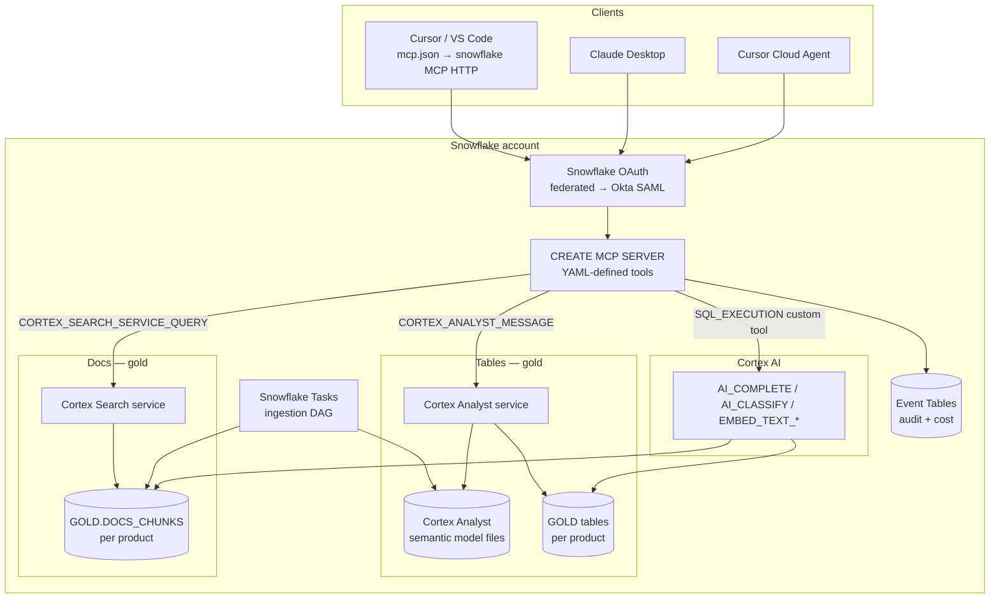
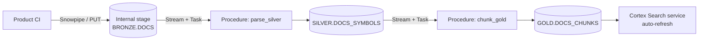
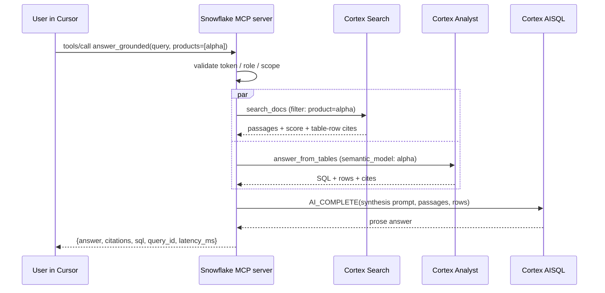

# 7. Design C — Snowflake managed

Everything in Snowflake. No external compute. The MCP endpoint is
Snowflake's first-party managed MCP server (GA Nov 2025), the
search is Cortex Search, the text-to-SQL is Cortex Analyst, and the
LLM calls are Cortex AISQL (`AI_COMPLETE` and related functions).

This is the most opinionated of the five designs and the simplest
when the data gravity (especially of the tables) is already in
Snowflake.

## 7.1 Reference architecture



## 7.2 Components

All inside one (or several federated) Snowflake account(s).

- **`CREATE MCP SERVER`** — Snowflake-managed MCP server object,
  defined via YAML spec. Lives as a first-class Snowflake object
  with RBAC.
- **Cortex Search service** over the `<DB>.GOLD.DOCS_CHUNKS` table,
  configured with a target text column and the hybrid (vector +
  lexical) search default. One service per product, or one shared
  service with `WHERE product = ?` in the underlying Cortex Search
  configuration.
- **Cortex Analyst** services, one per product, each with a
  semantic-model file in a Snowflake stage that describes the
  product's gold tables, joins, metrics, and curated example
  questions.
- **Cortex AISQL** functions used by `answer_grounded` to combine
  Cortex Search results and Cortex Analyst results into a final
  prose answer with citations.
- **Snowflake Tasks** + streams orchestrate docs-medallion ingestion
  (bronze → silver → gold → re-build search index). The tables
  medallion is owned by the data team using the existing
  Snowflake-native pipelines.
- **Event tables** capture Cortex events; `QUERY_HISTORY` captures
  every SQL the agents run.

No compute outside Snowflake. No VPC, no Fargate, no ALB.

## 7.3 YAML for the MCP server (sketch)

```yaml
name: RAG_BACKEND_MCP
version: '1.0.0'
description: |
  RAG over codebase docs and gold tables for the org's products.
tools:
  - name: search_docs
    type: CORTEX_SEARCH_SERVICE_QUERY
    target: <DB>.GOLD.DOCS_SEARCH_ALPHA
    description: Hybrid search over product alpha's docs.
  - name: search_docs_beta
    type: CORTEX_SEARCH_SERVICE_QUERY
    target: <DB>.GOLD.DOCS_SEARCH_BETA
  - name: answer_from_tables
    type: CORTEX_ANALYST_MESSAGE
    target: <DB>.GOLD.SEMANTIC_MODEL_ALPHA
    description: Text-to-SQL over product alpha's gold tables.
  - name: answer_from_tables_beta
    type: CORTEX_ANALYST_MESSAGE
    target: <DB>.GOLD.SEMANTIC_MODEL_BETA
  - name: answer_grounded
    type: CUSTOM
    handler: <DB>.RAG.SP_ANSWER_GROUNDED
  - name: list_products
    type: SQL
    statement: |
      SELECT product, description FROM <DB>.GOLD.PRODUCT_CATALOG
      WHERE current_role_can_see(product) = TRUE
```

The above is a sketch. Field names and the exact YAML shape track
Snowflake's `CREATE MCP SERVER` schema as documented; verify against
current docs before committing.

To match the interface contract in §2.1 of this set, define the
custom-tool stored procedures `SP_ANSWER_GROUNDED` and adapter SPs
that re-shape Cortex Search / Cortex Analyst outputs into the
contract response shape. The MCP server then exposes these wrapper
tools under the contract names.

## 7.4 RBAC and authorisation

- **Account-level roles** per product: `RAG_PRODUCT_ALPHA_READER`,
  `RAG_PRODUCT_BETA_READER`, plus `RAG_OPERATOR`. Roles are granted
  via Okta SCIM to keep group membership in sync with Okta.
- **Per-tool grants**: `GRANT USAGE ON MCP SERVER RAG_BACKEND_MCP
  TO ROLE RAG_PRODUCT_ALPHA_READER` etc.; per-tool grants where
  finer-grained.
- **Per-table row-access policies** on gold tables ensure that
  users only see rows whose `acl_tags` overlap their granted set.
- **Cortex Search service** is granted to roles per product;
  attempting `search_docs` on a service the role does not have
  access to fails at the Snowflake auth layer.
- **OAuth**: Snowflake's built-in OAuth service is enabled and
  federated to Okta. The MCP server validates tokens automatically;
  the role activated for the session is the one Okta passed via
  SAML attribute mapping.

End-user → data identity chain:

```
User in Cursor / VS Code
  → Okta SSO
  → Snowflake OAuth (Snowflake is the OAuth server)
  → Access token bound to MCP server audience
  → Session role from Okta SAML attribute
  → MCP tool invocation gated by role grants
  → Underlying Cortex Search / Cortex Analyst / SQL also gated by
    the same role
  → Row access policies further restrict row-level visibility
  → query_id in QUERY_HISTORY ties back to the user
```

The chain is shorter than in AWS designs because Snowflake is both
the OAuth server and the data layer.

## 7.5 Ingestion (docs medallion in Snowflake)



- **Bronze.** A Snowflake internal stage receives doc tarballs from
  each product's CI. Snowpipe optional; for low rates, a `PUT`
  from CI is enough.
- **Silver.** A Python or SQL stored procedure parses the raw doc
  tree into `SILVER.DOCS_SYMBOLS` (schema in §4.2.2). Snowpark
  Python is the natural choice for the parser.
- **Gold.** A second stored procedure produces
  `GOLD.DOCS_CHUNKS`, one row per chunk, with metadata and the
  chunk text. Embeddings are *not* stored in this table; Cortex
  Search owns its own vector index over the `text` column.
- **Cortex Search service** is configured with auto-refresh on the
  underlying table; new rows are picked up automatically.

For the tables medallion, the assumption is that the data team's
existing bronze/silver/gold pipelines are in place; the RAG
backend's responsibility is the semantic-model file for Cortex
Analyst over the gold tables.

## 7.6 Serving (a question end-to-end)



## 7.7 Pros and cons

**Pros**

- Zero compute outside Snowflake. No VPC, no ALB, no Cognito, no
  Glue.
- Data never leaves Snowflake. Strongest data-gravity story for
  the tables side.
- One identity provider chain: Okta → Snowflake. RBAC, row-access
  policies, and tool grants are all Snowflake-native.
- Re-ranking, hybrid search, and text-to-SQL are first-party
  features; no glue code.
- Audit via `QUERY_HISTORY` + Event Tables is exhaustive.

**Cons**

- Code docs that live in S3 / git must be loaded into Snowflake
  bronze before they can be served. For some orgs this is policy
  acceptable; for some, "make a copy of the docs into the
  warehouse" is friction.
- The MCP tool surface is constrained by what the managed MCP
  server can express. Custom mutating tools require Snowflake
  stored procedures.
- LLM model choice is constrained to Cortex's catalogue. (Claude
  Sonnet/Opus, Llama, Mistral, and others are available via Cortex,
  but the set is Snowflake-curated.)
- Snowflake costs are warehouse-credit-shaped; Cortex Search +
  Cortex Analyst usage costs are visible only through Snowflake's
  cost reporting.

## 7.8 Build plan (by stage)

**Stage 1 — Account prep.**

1. Snowflake account configured with Cortex AI features enabled in
   the chosen region.
2. Okta SAML IdP wiring; Snowflake OAuth security integration for
   the MCP audience.
3. RBAC: roles per product + operator; SCIM sync from Okta.

**Stage 2 — Tables-medallion semantic models.**

4. For each product, author the Cortex Analyst semantic-model YAML
   referencing gold tables, joins, metrics, and curated
   questions.
5. Stage and validate the semantic model with example queries.

**Stage 3 — Docs-medallion ingestion.**

6. Internal stages for bronze docs per product.
7. Snowpark Python parser for silver.
8. Stored procedure for gold chunking; load into
   `GOLD.DOCS_CHUNKS`.
9. Streams + Tasks to keep gold up to date as bronze lands.

**Stage 4 — Cortex Search services.**

10. One Cortex Search service per product (or one filtered) over
    `GOLD.DOCS_CHUNKS`.
11. Smoke test retrieval with sample queries.

**Stage 5 — Custom stored procedures for the MCP contract.**

12. `SP_ANSWER_GROUNDED(query, products)` — calls Cortex Search +
    Cortex Analyst + AI_COMPLETE, returns the contract shape.
13. Adapter stored procedures for `search_docs`, `search_tables`,
    `answer_from_docs` so the MCP YAML can expose them under the
    contract names.

**Stage 6 — MCP server.**

14. `CREATE MCP SERVER` with the YAML in §7.3, expanded for both
    products and the custom tools.
15. Per-role grants on the MCP server and underlying services.

**Stage 7 — Client wiring + test.**

16. Sample `.cursor/mcp.json` and `.vscode/mcp.json` snippets
    pointing at the Snowflake MCP HTTP endpoint with OAuth.
17. End-to-end test from Cursor, VS Code, and Claude Desktop with
    a real user, exercising every tool.

**Stage 8 — Onboarding.**

18. New product = (a) add to product catalogue, (b) author its
    semantic-model file, (c) start ingesting docs into its bronze
    stage, (d) grant role.

## 7.9 When to pick Design C

- The org's table data is already in Snowflake.
- Org policy prefers data not leave Snowflake.
- The team is comfortable with Snowflake-native tooling (Snowpark,
  Tasks, Streams, Cortex).
- LLM choice is acceptable from the Cortex catalogue.
- A single-vendor backend is a positive, not a negative.

When *not* to pick Design C:

- Strong investment in AWS-side tooling (Bedrock Agents,
  Step Functions, custom Lambdas) that you want to keep using.
- A requirement for a model not available via Cortex.
- A requirement to write the MCP server in Python/TS with custom
  middleware that doesn't map to Snowflake's managed MCP shape.

## 7.10 Failure modes

| Failure | Effect | Mitigation |
|---|---|---|
| Cortex Search index lag after large bronze drop | Stale answers | Auto-refresh interval is configurable; force-refresh task. |
| Cortex Analyst hallucinated SQL | Wrong rows | Curated questions + strict semantic-model + show SQL + cite columns. |
| MCP YAML deploy error | All clients fail | Versioned MCP server objects + blue/green by renaming. |
| Token expiry mid-session | Client disconnect | Standard OAuth refresh. |
| Snowflake region outage | Total outage | Cross-region replication of gold + a standby MCP server in a second region. |
