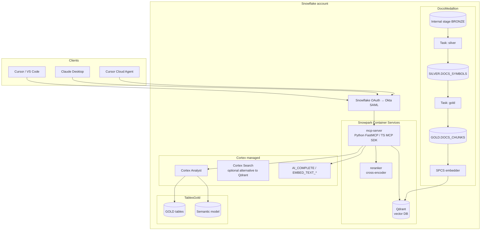

# 8. Design D — Snowflake self-managed

Snowflake remains the data-and-compute boundary, but the MCP server
is *not* the managed `CREATE MCP SERVER`. Instead, a custom MCP
server runs as a service in Snowpark Container Services (SPCS),
inside the Snowflake account boundary, with full programmatic
control over tools, middleware, and behaviour. Cortex Analyst is
still used for text-to-SQL (no reason to rewrite that). The vector
store for docs is either Cortex Search (managed) *or* a
self-managed vector DB (e.g., Qdrant) running in SPCS.

This is the "Snowflake-only" answer for an org that wants
Snowflake's data gravity but cannot accept the constraints of the
managed MCP server's YAML-driven tool definitions.

## 8.1 Reference architecture

## 8.2 Why Snowpark Container Services?

SPCS lets a container run inside the Snowflake account boundary,
addressable from the Snowflake network without egress, with native
Snowflake authentication. For a custom MCP server this is the
closest equivalent of "ECS Fargate but inside Snowflake."

Properties that matter here:

- The container's identity is a Snowflake **service role**;
  Snowflake RBAC governs which Snowflake objects it can read.
- Containers can be reached from outside Snowflake via a
  Snowflake-issued endpoint with OAuth auth (so Cursor / VS Code
  can connect).
- Containers can be reached from inside Snowflake via internal
  service URLs (so a Snowflake task could call the embedder).
- No VPC, no NAT gateway, no ALB; Snowflake takes the role of the
  network plane.

## 8.3 Components

- **`mcp-server`** — a custom MCP server in Python (FastMCP) or
  TypeScript (official MCP SDK). Implements the full §2.1 tool
  surface. Speaks Streamable HTTP. Handles OAuth token validation
  (Snowflake-issued tokens). Performs in-process retrieval (Qdrant
  or Cortex Search) + rerank + LLM call orchestration.
- **`embedder`** — a container batch service that embeds new
  chunks and upserts into Qdrant.
- **`reranker`** — optional. Hosts a cross-encoder; called by the
  MCP server before final LLM synthesis. Skip if using
  Cortex-side reranker.
- **`qdrant`** — SPCS-hosted Qdrant for the docs index. Alternative:
  drop Qdrant and use Cortex Search (which makes this design
  collapse partly into Design C).
- **Cortex Analyst, Cortex AISQL** — managed Snowflake features;
  not replaced.
- **Tasks/Streams** for ingestion.

## 8.4 RBAC

Same shape as Design C, plus:

- `RAG_SERVICE_ROLE` — the SPCS service identity. Owns the Qdrant
  collection (Snowflake-side ACL on the SPCS service endpoint),
  reads `GOLD.DOCS_CHUNKS` for ingestion, calls Cortex Analyst.
- The MCP server is granted `USAGE` on the SPCS service endpoint;
  Snowflake's RBAC + OAuth gate ingress.

## 8.5 Pros and cons

**Pros**

- Full programmatic control over the MCP tool surface, middleware,
  rate limits, multi-step tool orchestration, and prompt assembly.
- No data egress from Snowflake.
- Cortex Analyst still owned by Snowflake; no need to rewrite
  text-to-SQL.
- Can choose any vector DB SPCS can host (Qdrant, Weaviate, Milvus,
  pgvector on a PostgreSQL container).

**Cons**

- Two services to operate (MCP + embedder + optional reranker +
  Qdrant) inside SPCS instead of zero in Design C.
- SPCS operational properties (autoscaling, deployments, image
  storage) must be learned in addition to Cortex.
- The reason to bypass the managed MCP server has to be a real
  one; otherwise this design is strictly more work than C for the
  same outcome.

## 8.6 Build plan

**Stage 1 — Snowflake foundations.** Same as Design C Stage 1, plus
SPCS compute pool sized for the MCP + embedder containers, image
repository, network rules to allow the SPCS service to be reached
externally via Snowflake-issued endpoint.

**Stage 2 — Docs medallion ingestion.** Same as Design C, except
the gold layer's chunks are also embedded by the SPCS embedder and
upserted into Qdrant.

**Stage 3 — Qdrant deployment.**

- Container manifest for Qdrant in SPCS.
- Collection creation with the expected vector dimension and
  metadata payload schema.

**Stage 4 — MCP server.**

- Implement the §2.1 tools.
- Hybrid retrieval (Qdrant vector search + sparse BM25 either from
  Qdrant's payload index or from a separate sparse index).
- Cortex Analyst integration for the table tools.
- OAuth token validation against Snowflake's OIDC discovery.

**Stage 5 — Reranker (optional).**

- Cross-encoder container in SPCS.

**Stage 6 — Client wiring + test.** As in Design C.

**Stage 7 — Onboarding.** As in Design C, plus: Qdrant collection
filter on `product`.

## 8.7 When to pick Design D over C

Pick D over C if **any** of:

- A tool implementation cannot be expressed in the managed MCP
  server's YAML (e.g., complex multi-step orchestration, external
  HTTP call from inside a tool, custom rate limiting / quota).
- A vector store with features Cortex Search lacks is required
  (e.g., a specific ANN type, payload-based filters Cortex Search
  doesn't expose).
- The team needs to write MCP middleware in Python/TS for
  cross-cutting concerns (custom logging, custom auth, custom
  feature flags).

Otherwise: Design C is strictly better.

## 8.8 Failure modes

| Failure | Effect | Mitigation |
|---|---|---|
| SPCS service crash | MCP outage | SPCS auto-restart + multiple replicas. |
| Qdrant data loss | Re-index needed | Persistent volume; regular snapshot to a Snowflake stage. |
| Embedder lag | Stale answers | Backlog metric; alerting on `last_embedded_at`. |
| OAuth misconfig | All clients fail | Same as Design C; staged rollout of MCP server endpoint. |
