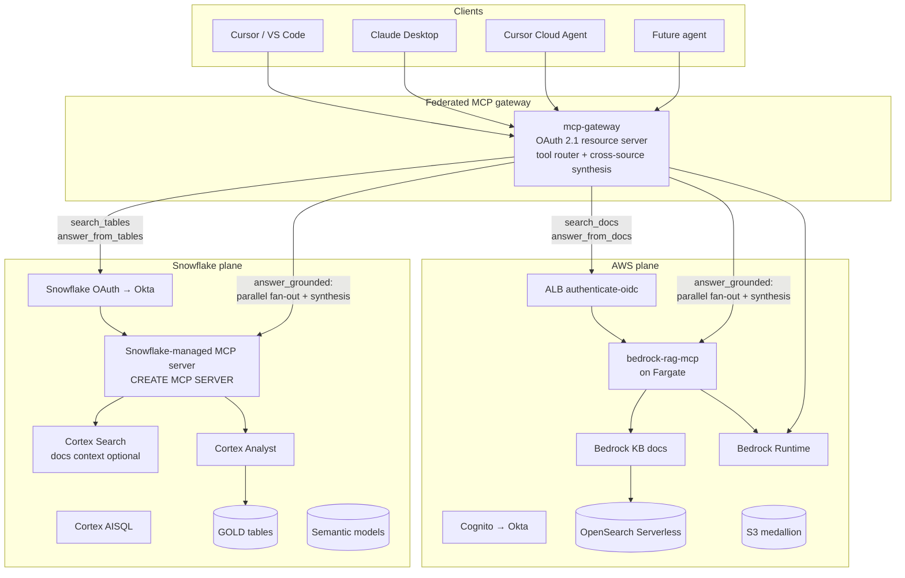
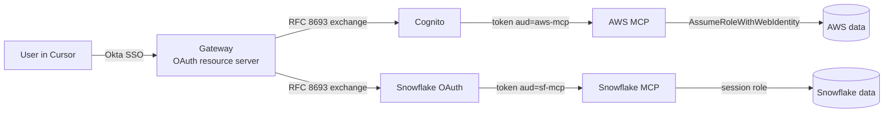

# 9. Design E — Hybrid AWS + Snowflake (recommended)

Code documentation RAG on AWS; table RAG on Snowflake. A
**federated MCP gateway** in front of both fans tool calls out to
the right side. Each side is configured exactly as in its
single-platform design — so we get the strengths of A and C without
forcing either side's data to move.

This is the recommended design for the stated org state: two
products today, more coming, codebase docs already in git/S3,
business tables already in Snowflake.

## 9.1 Reference architecture

## 9.2 What the gateway does

The federated MCP gateway is the single MCP endpoint clients
configure. It does five things:

1. **OAuth 2.1 resource server.** Validates the caller's
   Okta-issued token. The audience is the gateway, not the
   downstream MCP servers.
2. **Tool routing.** The §2.1 tool set is partitioned: doc-tools
   route to the AWS-side MCP, table-tools route to the
   Snowflake-side MCP. The gateway exposes the union under the
   contract names.
3. **Token exchange (RFC 8693).** For each downstream call, mint a
   new token bound to the downstream MCP server's audience and
   carrying the caller's `sub`. Two distinct OAuth servers
   (Cognito and Snowflake OAuth) → two distinct downstream tokens.
4. **Cross-source synthesis.** For `answer_grounded`, fan out to
   both sides in parallel, then call Bedrock (or Cortex AISQL,
   configurable) to compose the final answer with merged citations.
5. **Unified audit.** Emit a single event per top-level tool call
   that includes the downstream `bedrock.kb_request_id` and the
   Snowflake `query_id`. Per-side logs remain in their native
   stores.

The gateway is **not** a new authoritative data layer. It owns no
state beyond rate-limit counters and short-lived caches.

## 9.3 Where the gateway runs

Three options:

- **a) Fargate next to the AWS-side MCP.** Same VPC, same auth
  chain, same observability. Default.
- **b) SPCS next to the Snowflake-side MCP.** Mirrors (a) on the
  Snowflake side; valid if Snowflake's account is the org's hub.
- **c) A neutral plane** (e.g., Cloudflare Workers + Cloudflare
  Access). Useful if neither AWS nor Snowflake is the "home" for
  the gateway, or if the gateway must serve clients from
  geographies where one of the planes is far away.

Default: **(a) Fargate**, because the team already has the AWS
foundations from Design A.

## 9.4 Snowflake table integration

In Design E, the table integration is **native**: no replication,
no federation hack. Cortex Analyst queries gold tables directly
inside Snowflake. The gateway routes the tool call to Snowflake.
This eliminates the dual-warehouse cost and the replication lag
that haunted Design A.

## 9.5 Components

### 9.5.1 AWS side — exactly Design A

- VPC, ALB, Cognito, ECS Fargate, MCP server, Bedrock KB (docs),
  OpenSearch Serverless, Bedrock Runtime, S3 medallion, Glue,
  Step Functions.
- **One change**: the structured Bedrock KB and the Redshift mirror
  are **removed**. Tables are not served from AWS in this design.

### 9.5.2 Snowflake side — exactly Design C minus the docs medallion

- Cortex Analyst over gold tables, semantic models per product.
- Cortex AISQL for any LLM call the Snowflake-side MCP needs.
- Snowflake-managed MCP server (`CREATE MCP SERVER`) exposing the
  table tools.
- Tasks/Streams for table-medallion ownership (data-team-owned).
- **No docs ingestion on the Snowflake side.** The docs medallion
  lives on AWS.

### 9.5.3 Gateway

- Stateless Python or Go service implementing the MCP server
  surface from §2.1.
- Maintains two MCP clients internally (one to AWS MCP, one to
  Snowflake MCP) and the OAuth-token-exchange logic.
- Owns the unified prompt for `answer_grounded`.

## 9.6 Auth and identity

Three OAuth servers in play: Okta (IdP), Cognito (for AWS plane),
Snowflake OAuth (for Snowflake plane). The gateway is the only
component that knows about all three. Clients see one.

### 9.6.1 Token-exchange details

- Caller's incoming token: `aud=gateway`, `iss=Okta` (via the
  gateway's authorization server, which itself federates Okta).
- Outgoing to AWS plane: `aud=aws-mcp`, `iss=Cognito`, `sub=caller`.
- Outgoing to Snowflake plane: `aud=sf-mcp`, `iss=snowflake-oauth`,
  `sub=caller`.

The token exchange is performed by the gateway against each
downstream OAuth server using the gateway's registered confidential
client (per-side). RFC 8693 `urn:ietf:params:oauth:grant-type:token-exchange`
is the standard mechanism; Cognito and Snowflake OAuth both
support equivalent flows (verify against current docs).

> Caveat: at the time of writing, Cognito's RFC-8693 support and
> Snowflake's OAuth exchange semantics each have quirks. If
> token-exchange isn't viable, the fallback is: gateway authenticates
> to each downstream as a service principal and passes the caller's
> `sub` in a signed assertion header that the downstream MCP
> validates. This is the same defence-in-depth pattern as Cloudflare
> Access's `Cf-Access-Jwt-Assertion`.

## 9.7 Cross-source synthesis (`answer_grounded`)

Algorithm:

1. Caller invokes `tools/call answer_grounded(query, products)`.
2. Gateway:
   a. Calls `search_docs(query, products)` against AWS MCP.
   b. Calls `search_tables(query, products)` against Snowflake MCP.
   c. Optionally also calls `answer_from_tables(query, products)`
      against Snowflake MCP for cases where the search-tables
      result strongly suggests an analytical answer is needed (a
      heuristic gate on the top result's score).
3. Gateway assembles the merged context (docs passages + table
   rows + SQL) and prompts Bedrock Claude Sonnet/Opus with the
   `cross_source_synthesis` system prompt to produce the final
   answer.
4. Gateway returns `{answer, citations, sql?, tools_used}`.

The "two parallel retrievals + one synthesis call" pattern is
deliberate: it keeps latency at one round-trip per side plus one
LLM call, instead of letting a model decide ad hoc.

## 9.8 Pros and cons

**Pros**

- Each side runs in its native shape (Design A on AWS, Design C on
  Snowflake), so each gets the best available tooling.
- No data migration. Codebase docs stay where their CI puts them;
  tables stay where the data team owns them.
- Adding more products is uniform: a row in the product taxonomy
  YAML, ingestion on both sides, RBAC grants on both sides.
- Future consolidation (everything to Snowflake, or everything to
  AWS) is a routing change in the gateway, not a rewrite.
- The "future agentic features" can attach as additional MCP
  servers fan-out from the gateway (e.g., a "ticketing-mcp" or a
  "deployment-mcp" server) without touching either data plane.

**Cons**

- Three things to operate: gateway + AWS plane + Snowflake plane.
- Three OAuth servers configured. More moving auth parts than
  either single-platform design.
- Cross-source synthesis is an LLM call: cost is higher per
  `answer_grounded` than per single-source answer.
- Token exchange is non-trivial; the fallback (service-principal +
  signed assertion) is reasonable but requires care.

## 9.9 Multi-product handling

- Product taxonomy YAML is the contract. Lives in this repo, read
  by AWS ingestion + Snowflake ingestion + the gateway.
- AWS side enforces product filter via Bedrock KB
  metadata-filter + Cognito groups → scopes.
- Snowflake side enforces product filter via per-product Cortex
  Search services / per-product semantic models + per-product
  roles.
- Gateway maps caller's Okta groups to a normalised
  `authorised_products: [...]` claim, included in the downstream
  tokens.

A user authorised for product alpha only:

- Gets back only alpha doc citations from AWS MCP.
- Gets back only alpha table results from Snowflake MCP.
- Cannot even discover beta in `list_products` because the
  gateway filters that catalogue, too.

## 9.10 Build plan

**Stage 0 — Product taxonomy.** Author the shared YAML in this
repo. Two products today.

**Stage 1 — AWS plane.** Execute Design A Stages 1–5, **omitting**
the structured Bedrock KB / Redshift mirror (steps 11–12).

**Stage 2 — Snowflake plane.** Execute Design C Stages 1–6,
**omitting** the docs medallion (steps 6–11). What remains: roles,
OAuth, semantic models, Cortex Analyst, Cortex AISQL, the
managed MCP server exposing table tools.

**Stage 3 — Gateway.**

- Implement `mcp-gateway` in Python or Go.
- Two MCP clients (AWS, Snowflake).
- OAuth resource-server middleware (Okta as IdP) for the gateway's
  own endpoint.
- Per-side token-exchange clients.
- Cross-source synthesis using Bedrock Converse.
- Deploy on Fargate behind a Cloudflare-Access or ALB-OIDC edge.

**Stage 4 — Client wiring.**

- Sample `.cursor/mcp.json`, `.vscode/mcp.json`, Claude Desktop
  config with the gateway URL.
- One MCP endpoint to remember.

**Stage 5 — End-to-end test.**

- Every tool from §2.1, exercised from Cursor, VS Code, Claude
  Desktop, and a Cursor Cloud Agent.
- A user authorised for one product only: assert isolation.
- A long `answer_grounded` query that hits both sides: assert
  correct citations on both sides.

**Stage 6 — Hardening.**

- Per-caller rate limits in the gateway.
- Unified per-tool dashboard (CloudWatch + Snowflake event-table
  cross-stitched on `request_id`).
- Cost budget alerts on Bedrock + Snowflake compute.

**Stage 7 — Onboarding (per additional product).**

- Add to taxonomy YAML.
- Add Okta group.
- AWS side: Cognito group, KB metadata, Bedrock KB ingestion will
  pick up the new `product=` prefix.
- Snowflake side: per-product role, semantic model, Cortex Search
  service if used, `CREATE MCP SERVER` YAML update.

## 9.11 When to pick Design E

Default unless:

- Tables are not in Snowflake (then Design A).
- Docs are *also* in Snowflake (then Design C).
- The org has a strict single-vendor mandate (then A or C
  depending on which vendor).

## 9.12 Failure modes

| Failure | Effect | Mitigation |
|---|---|---|
| AWS plane outage | Doc tools fail; table tools still work | Gateway returns partial-success with explicit `tools_used: [tables_only]` |
| Snowflake plane outage | Table tools fail; doc tools still work | Symmetric to above |
| Gateway outage | All clients fail | Multi-AZ, multi-replica; rolling deploys; client-side retry/backoff |
| Token-exchange misconfig | One plane unreachable | Healthcheck on each plane; staged config rollouts |
| Synthesis LLM throttling | Slow `answer_grounded` | Backoff + cross-region inference profile; degrade to "raw passages + raw rows" response |
| Product-taxonomy drift between planes | Authorisation bugs | CI check that fails if the YAML differs between consumers; canonical YAML pinned by `commit_sha` |
