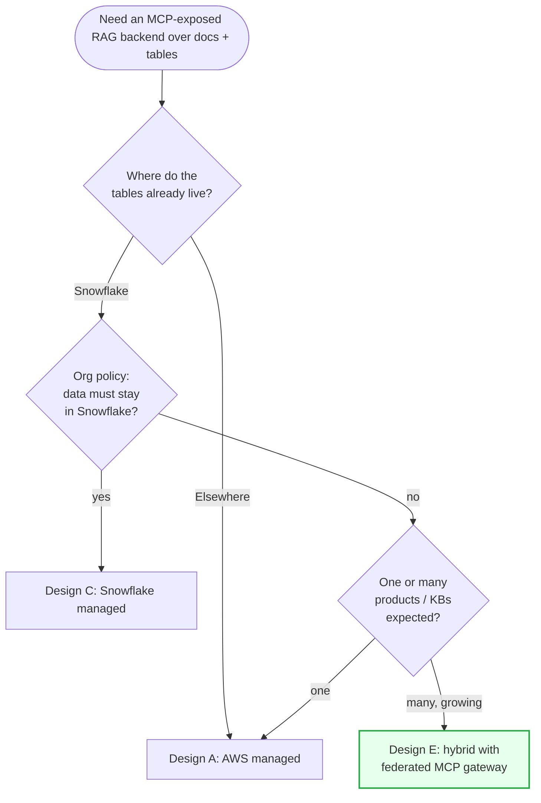

# Architecture — MCP-exposed RAG backend over codebase docs + Snowflake data

This directory holds the **system-design** plan for the next iteration
of the internal RAG assistant. It deliberately replaces the
Streamlit prototype with an **MCP-exposed backend** that runs on
compute (AWS, Snowflake, or both) and is consumed directly by IDE
clients (Cursor, VS Code, Claude Desktop) and by other agents.

This set is separate from, and additive to, the prior plans:

- `docs/deployment/` — hosting/auth options for the Streamlit demo.
  Still valid for the *demo* window. After the demo, the Streamlit
  front-end is removed in favour of the design here.
- `docs/deployment/06-mcp-cursor-approach.md` — the "MCP + Cursor"
  analysis for the demo. The chapter you're reading now takes that
  analysis to its logical conclusion: MCP is *the* interface, not
  an additive sidecar.

## Executive summary

- **Interface.** The backend exposes its capabilities **only via
  MCP** (Streamable HTTP transport, OAuth 2.1). IDEs (Cursor,
  VS Code), Claude Desktop, agents, and any future custom client
  all use the same servers. A thin REST adapter ("API-through-MCP")
  is described as an option for clients that cannot speak MCP yet.

- **Data.** The knowledge base is built from two product codebases'
  documentation (today; growing) and from Snowflake-resident
  business data exposed at the **gold** medallion layer. The
  medallion structure spans both surfaces: code docs and tables.

- **Five designs are evaluated** in `05`–`09`:
  - **A. AWS managed** — Bedrock Knowledge Bases (with the
    appropriate managed vector store) + Bedrock Runtime + a custom
    MCP server on Fargate. Closest fit to the current prototype.
  - **B. AWS self-managed** — Aurora pgvector or self-hosted
    OpenSearch/Qdrant + custom ingestion pipeline + Bedrock for
    LLM/embeddings + MCP server on Fargate.
  - **C. Snowflake managed** — Cortex Search (hybrid search),
    Cortex Analyst (text-to-SQL over tables), Cortex AISQL
    (LLM functions), exposed through the **Snowflake-managed MCP
    server** (GA Nov 2025, `CREATE MCP SERVER`). Zero compute
    outside Snowflake.
  - **D. Snowflake self-managed** — Snowpark Container Services
    hosting a bring-your-own vector DB + custom MCP server inside
    Snowflake's account boundary, calling Cortex Analyst for table
    Q&A.
  - **E. Hybrid AWS + Snowflake** — code-docs RAG on AWS (Bedrock
    KB), table data on Snowflake (Cortex Search / Analyst), a
    **federated MCP gateway** that routes tool calls to the right
    platform.

- **Recommendation** (see `10-comparison-and-recommendation.md`):
  start with **Design E (hybrid)** behind a federated MCP gateway,
  with the gold-layer tables already in Snowflake and the
  code-docs KB on Bedrock. The gateway pattern makes the eventual
  consolidation (toward C or A) a routing change, not a rewrite.

## Decision diagram

(Green = primary recommendation for the org's stated state: two
products, table data already in Snowflake, more products coming.)

## Table of contents

1. [Context and Requirements](./01-context.md) — what changed since
   the Streamlit prototype; constraints driving this redesign.
2. [Interface: MCP as the only front door](./02-interface-mcp.md) —
   MCP-only vs API-through-MCP, IDE client realities, the
   Snowflake-managed MCP server.
3. [RAG building blocks](./03-rag-building-blocks.md) — vector store
   options (managed vs independent), chunking strategies, indexing,
   hybrid retrieval, metadata schema, multi-product partitioning.
4. [Medallion structure](./04-medallion.md) — bronze/silver/gold for
   code documentation **and** for Snowflake table context, with the
   cross-medallion contract between them.
5. [Design A — AWS managed](./05-design-aws-managed.md).
6. [Design B — AWS self-managed](./06-design-aws-self-managed.md).
7. [Design C — Snowflake managed](./07-design-snowflake-managed.md).
8. [Design D — Snowflake self-managed](./08-design-snowflake-self-managed.md).
9. [Design E — Hybrid AWS + Snowflake](./09-design-hybrid.md).
10. [Comparison and Recommendation](./10-comparison-and-recommendation.md).

Each design document (`05`–`09`) follows the same template:

- Reference architecture (Mermaid)
- Components (data plane, control plane, ingestion, serving, MCP)
- IAM / RBAC / policies
- Networking and identity
- Ingestion flow (medallion-aware)
- Serving flow (a user question end-to-end)
- Multi-product handling
- Snowflake-table integration
- Pros / cons
- Step-by-step build plan, by stage
- Failure modes and operability

## How to read this set

- **5 minutes** — this README + §1 of
  [`10-comparison-and-recommendation.md`](./10-comparison-and-recommendation.md).
- **30 minutes** — this README, [`01-context.md`](./01-context.md),
  [`02-interface-mcp.md`](./02-interface-mcp.md), the comparison and
  recommendation chapter, and skim the recommended design's chapter.
- **The full build** — read everything; work from the recommended
  design's "build plan" section.

## What's explicitly out of scope here

- The model evaluation / eval-harness framework (separate workstream).
- The codebase-docs *generation* pipeline (assumed: someone is
  already producing docs from the codebases; we ingest them).
- Production multi-region / DR strategy.
- Cost optimisation (prompt caching, model routing, batching) —
  qualitative cost ranking is included; precise pricing is not.

## Verifiability note

Several facts about service capabilities (especially Snowflake's
managed MCP server, Bedrock KB structured-data source, and the
exact vector-store enum supported by Bedrock KB) were verified
against current docs at the time of writing. They are called out
inline. Re-verify before committing to detail-level design — these
surfaces are moving fast.
