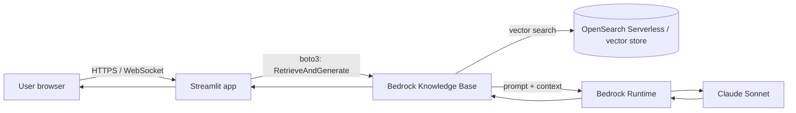

# 1. Context and Requirements

This chapter establishes a shared understanding of what is being deployed,
who will use it, and the constraints the deployment must respect. Every
later chapter (each candidate approach, authentication, comparison,
recommendation) refers back to the requirements and decision drivers
defined here.

---

## 1.1 What the app is today

A prototype **Retrieval-Augmented Generation (RAG) chatbot** built with:

| Layer            | Technology / Service                                              |
| ---------------- | ----------------------------------------------------------------- |
| UI               | [Streamlit](https://streamlit.io/) (Python)                       |
| Orchestration    | Plain Python in the Streamlit process                             |
| LLM              | **Anthropic Claude Sonnet** via **Amazon Bedrock**                |
| Retrieval / KB   | **Amazon Bedrock Knowledge Bases** (built on org documentation)   |
| AWS SDK          | `boto3`                                                           |
| Hosting (today)  | The author's local laptop                                         |
| AuthN / AuthZ    | None (local only)                                                 |
| State            | In-process Streamlit session state                                |

Conceptually, every user request follows this path:

Streamlit's transport is HTTP + a long-lived WebSocket (`/_stcore/stream`).
Any deployment, load balancer, or auth proxy in front of the app **must**
support WebSocket upgrades and sticky sessions, or the UI will appear to
hang on first interaction. This single fact eliminates a surprising number
of otherwise-attractive options (e.g. AWS Lambda + API Gateway HTTP API
without `$default` WebSocket routes, plain CloudFront with default
behaviors, S3 static hosting, etc.).

---

## 1.2 Where the app is going

The user has stated three forward-looking goals. The deployment plan needs
to keep them reachable without locking us in now.

1. **Agentic workflows** — the chatbot should be able to take actions on
   AWS resources (Bedrock Agents, custom tool calls, eventually
   write-actions on AWS APIs). This implies:
   - Workloads will get **longer-running** (multi-step tool use, possibly
     minutes per request).
   - The app will need **richer IAM permissions** than read-only Bedrock.
   - The runtime should be able to **call other AWS services** privately
     (VPC endpoints, no NAT egress for sensitive traffic).
2. **Larger model (Claude Opus)** — higher latency and higher per-token
   cost; the runtime needs generous request timeouts (no 30 s API
   Gateway / App Runner default cutoffs that bite us).
3. **Org-wide access with SSO** — most likely **Okta**, possibly a simpler
   stand-in for the demo. Deployment must allow placing an
   identity-aware proxy or SAML/OIDC integration in front of the app.

These goals push the recommendation toward an architecture that supports
**long-lived containers in a VPC, with an IAM role attached and an
auth-aware proxy in front**, rather than serverless or static-hosting
patterns.

---

## 1.3 Goal of *this* deployment

This document plans the **demo deployment** — a test run for people inside
the organization, not the production rollout. Specifically:

| Aspect                | Target for this demo                                            |
| --------------------- | --------------------------------------------------------------- |
| Audience              | ~10–50 internal users, all employees                            |
| Concurrency           | ≤ 5 simultaneous chats expected, ≤ 20 worst case                |
| Availability          | Business hours, single AZ acceptable, no SLA                    |
| Data sensitivity      | Internal docs only; no PII / regulated data                     |
| Lifespan              | Weeks, not months; expected to be torn down or rebuilt          |
| Budget                | Low (hundreds of USD/month range, not thousands)                |
| Operational effort    | Should be runnable by one engineer without an on-call rotation  |
| Reversibility         | Must be easy to throw away and replace once feedback is in      |

The demo is a **learning vehicle**, not a product. Optimize for *speed of
feedback* and *low blast radius*, not for elegance or future-proofing —
but do not make choices that block the production path described in §1.2.

---

## 1.4 Non-functional requirements

These are the constraints every candidate approach is scored against in
[`04-comparison-matrix.md`](./04-comparison-matrix.md).

### 1.4.1 Security and credentials (most important)

- **No long-lived AWS access keys** baked into the app, container image,
  Streamlit secrets, or any third-party platform. The runtime must
  authenticate to AWS via an **IAM role** (instance profile, task role,
  or App Runner instance role).
- **Bedrock invocation must happen from inside the organization's AWS
  account**, so logs, costs, guardrails and audit are visible in the
  org's own CloudTrail / Cost Explorer.
- **Knowledge Base data does not leave AWS.** Retrieved chunks may
  contain internal documentation; they must not transit a third-party
  SaaS unnecessarily.
- The app must be **non-public**: no anonymous user on the internet
  should be able to load it or hit its Bedrock-backed endpoints.

### 1.4.2 Authentication and access control

- Org-wide **SSO** (Okta preferred). If full SSO is too heavy for the
  first cut, a temporary stop-gap (shared password, IP allow-list,
  Cloudflare Access with email OTP) is acceptable *only* if the
  switchover to Okta does not require re-architecting the deployment.
- Per-user **identity must reach the app** (header or token) so future
  agentic actions can be attributed and audited.

### 1.4.3 Streamlit-specific runtime needs

- **WebSocket support** end-to-end (browser → proxy → app).
- **Sticky sessions** if more than one app replica runs behind a load
  balancer (Streamlit holds session state in process memory).
- **Long request timeouts** (≥ 120 s; ideally 5–10 min for future
  agentic flows). Many "easy" PaaS options cap at 30–60 s.
- **Persistent process** — no cold-start serverless model fits cleanly.

### 1.4.4 Operability

- **Logs and metrics** centralised somewhere queryable (CloudWatch is
  fine).
- **One-command redeploy** of a new app version.
- **Cost visible per service** in AWS Cost Explorer.
- **Tear-down** should be a single `terraform destroy` / `cdk destroy` /
  `aws ... delete-service` away.

### 1.4.5 Cost envelope (rough)

- Hosting (compute + LB + logs): target **< $100 / month** for the demo
  window.
- Bedrock usage is **out of scope** of this hosting cost — it is paid per
  token regardless of where the app runs, and dominates total spend.

---

## 1.5 Decision drivers (ranked)

When two options score similarly, break ties using this order:

1. **Security posture** — IAM-role-based auth to AWS, private network
   path to Bedrock, non-public UI.
2. **Future fit** — does it survive the move to Claude Opus + agentic
   actions + Okta SSO without a rewrite?
3. **Time-to-first-user** — how fast can the demo actually be in front
   of internal testers?
4. **Operational simplicity** — minutes/week of maintenance.
5. **Cost** — at this scale, mostly a tiebreaker, not a driver.

---

## 1.6 Out of scope for this document

The following are intentionally *not* decided here. They will be picked
up in follow-on docs once the demo deployment exists:

- Production multi-region or DR strategy.
- CI/CD pipeline design (a minimal GitHub Actions / CodePipeline outline
  is sketched per approach, but the canonical pipeline is a separate
  doc).
- Bedrock Knowledge Base ingestion pipeline (data source, chunking,
  embeddings model selection).
- Evaluation / guardrails framework (Bedrock Guardrails, ragas, etc.).
- Cost optimisation of Bedrock usage (prompt caching, model routing).
- The agentic framework choice (Bedrock Agents vs. LangGraph vs. custom).
