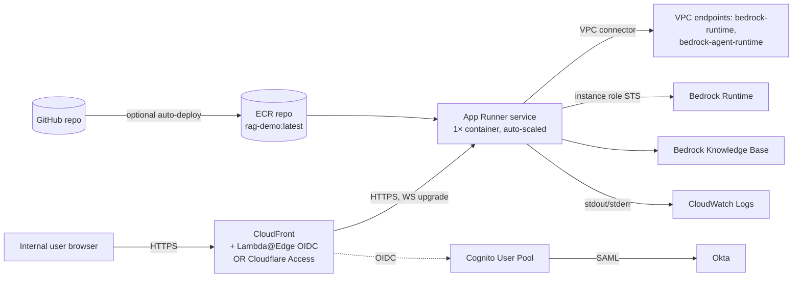

# Approach F — AWS App Runner

> Fully managed container service. Point it at an ECR image or a
> GitHub repo, get an HTTPS endpoint with autoscaling, managed TLS,
> and IAM instance roles. No ALB to manage, no VPC required (but
> supported via VPC connector).

## TL;DR

The lowest-ops AWS-native option that still meets every requirement
in [`../01-context.md` §1.4](../01-context.md): the runtime gets an
**IAM instance role** for Bedrock, a **VPC connector** for private
network egress, **WebSocket support** end-to-end, and a **managed TLS
endpoint** at `<service>.<region>.awsapprunner.com`. The one missing
piece is *identity-aware authentication* — App Runner has no built-in
SSO. You add it by putting CloudFront + Cognito (via Lambda@Edge) in
front, by using a custom domain behind Cloudflare Access, or by doing
the OIDC handshake inside Streamlit itself (`st.login`).

**Verdict for this demo:** **Recommended primary option** if the team
wants minimal ops and is comfortable with one of the auth patterns
below. See [`../05-recommendation.md`](../05-recommendation.md).

## Architecture



## Setup walkthrough

### F.1 Build & push the image

```bash
aws ecr create-repository --repository-name rag-demo
aws ecr get-login-password --region us-east-1 | \
  docker login --username AWS --password-stdin <acct>.dkr.ecr.us-east-1.amazonaws.com

docker build -t rag-demo:0.1.0 .
docker tag rag-demo:0.1.0 <acct>.dkr.ecr.us-east-1.amazonaws.com/rag-demo:0.1.0
docker push <acct>.dkr.ecr.us-east-1.amazonaws.com/rag-demo:0.1.0
```

`Dockerfile`:

```dockerfile
FROM public.ecr.aws/docker/library/python:3.11-slim
WORKDIR /app
COPY requirements.txt .
RUN pip install --no-cache-dir -r requirements.txt
COPY . .
EXPOSE 8501
HEALTHCHECK CMD curl -fsS http://127.0.0.1:8501/_stcore/health || exit 1
CMD ["streamlit", "run", "app.py", \
     "--server.port=8501", "--server.address=0.0.0.0", \
     "--server.enableXsrfProtection=true", \
     "--server.enableCORS=false", \
     "--server.headless=true"]
```

### F.2 IAM roles

Two roles:

- **Access role** (`AppRunnerECRAccessRole`) — lets App Runner pull
  from ECR.
- **Instance role** — assumed by the running container, calls Bedrock.

Instance role trust policy:

```json
{
  "Version": "2012-10-17",
  "Statement": [{
    "Effect": "Allow",
    "Principal": { "Service": "tasks.apprunner.amazonaws.com" },
    "Action": "sts:AssumeRole"
  }]
}
```

Permissions: the minimal Bedrock + KB policy from
[`local-tunnel.md`](./local-tunnel.md#aws-credentials--iam).

### F.3 VPC connector (recommended)

```bash
aws apprunner create-vpc-connector \
  --vpc-connector-name rag-demo \
  --subnets subnet-a subnet-b \
  --security-groups sg-apprunner-egress
```

Egress security group needs only outbound 443 to the Bedrock VPC
endpoint(s). With `EgressType=VPC`, App Runner routes all outbound
container traffic through the connector — including DNS — which means
the VPC must resolve Bedrock and ECR public DNS via Route 53
Resolver, or you must ensure VPC endpoints exist for everything the
container talks to (ECR API, ECR DKR, S3 for layers, Bedrock, KB,
CloudWatch Logs, STS).

### F.4 Create the service

```bash
aws apprunner create-service --cli-input-json file://service.json
```

`service.json`:

```json
{
  "ServiceName": "rag-demo",
  "SourceConfiguration": {
    "ImageRepository": {
      "ImageIdentifier": "<acct>.dkr.ecr.us-east-1.amazonaws.com/rag-demo:0.1.0",
      "ImageRepositoryType": "ECR",
      "ImageConfiguration": {
        "Port": "8501",
        "RuntimeEnvironmentVariables": {
          "AWS_REGION": "us-east-1",
          "KB_ID": "ABC123XYZ",
          "MODEL_ID": "anthropic.claude-3-sonnet-20240229-v1:0"
        }
      }
    },
    "AuthenticationConfiguration": {
      "AccessRoleArn": "arn:aws:iam::<acct>:role/AppRunnerECRAccessRole"
    },
    "AutoDeploymentsEnabled": true
  },
  "InstanceConfiguration": {
    "Cpu": "1 vCPU",
    "Memory": "2 GB",
    "InstanceRoleArn": "arn:aws:iam::<acct>:role/rag-demo-instance"
  },
  "NetworkConfiguration": {
    "EgressConfiguration": {
      "EgressType": "VPC",
      "VpcConnectorArn": "arn:aws:apprunner:us-east-1:<acct>:vpcconnector/rag-demo/1/..."
    },
    "IngressConfiguration": { "IsPubliclyAccessible": true }
  },
  "HealthCheckConfiguration": {
    "Protocol": "HTTP",
    "Path": "/_stcore/health",
    "Interval": 10,
    "Timeout": 5,
    "HealthyThreshold": 1,
    "UnhealthyThreshold": 3
  }
}
```

Within 2–4 minutes the service is reachable at
`https://<random>.<region>.awsapprunner.com`.

### F.5 Private ingress (optional but recommended)

Instead of `IsPubliclyAccessible: true`, set it to `false` and
attach a **VPC Ingress endpoint**. The service is then reachable
only from inside the VPC (or via PrivateLink). Combined with a small
CloudFront + Lambda@Edge auth layer, you can keep App Runner private
end-to-end. For the demo, public ingress + Cloudflare Access in
front is simpler.

## Authentication integration

See [`../03-authentication.md`](../03-authentication.md). Three viable
patterns for App Runner:

1. **Cloudflare Access + Okta in front of a custom domain.** Simplest
   to set up; same model as Approach (A) but pointed at the App
   Runner URL. App Runner supports CNAME-validated custom domains.
2. **CloudFront + Lambda@Edge OIDC → Cognito → Okta.** All-AWS. More
   moving parts.
3. **In-app `st.login` OIDC against Okta.** No proxy needed; the app
   itself does the redirect. Works on the App Runner default
   hostname. Downside: you cannot enforce auth at the edge, so a
   misconfigured route or an `/_stcore/...` exposure could leak.

For the demo, pattern 1 is the lightest-weight; pattern 2 is the
"production-shape" choice. Pick one and stick with it.

## Networking and security

- **Ingress:** Public HTTPS endpoint or PrivateLink. TLS managed by
  AWS.
- **Egress:** `EgressType=VPC` routes through the VPC connector, so
  Bedrock calls take the private path through VPC endpoints. Without
  the connector, egress is over App Runner's managed NAT — works
  fine, but breaks the "no internet egress" posture.
- **WebSockets:** supported natively, including for in-flight
  request timeouts up to 120 seconds per individual request. Long
  agentic flows that exceed 120 s per HTTP call will need
  chunking/streaming — but Streamlit's WS model already streams.
- **Secrets:** use the `RuntimeEnvironmentSecrets` field referencing
  Secrets Manager / SSM Parameter Store, not plain env vars, for
  anything sensitive.

## AWS credentials / IAM

App Runner injects credentials for the **instance role** via the same
mechanism ECS uses (`AWS_CONTAINER_CREDENTIALS_RELATIVE_URI`). `boto3`
picks them up automatically. No keys anywhere.

## Cost (us-east-1, demo workload)

App Runner pricing has two components: **provisioned** (always-on
memory) and **active** (compute when serving requests).

| Item                                  | Monthly                               |
| ------------------------------------- | ------------------------------------- |
| Provisioned: 1× (2 GB, ~$0.007/GB-h)  | ~$5                                   |
| Active: 1 vCPU × ~30 h active / mo    | ~$2                                   |
| VPC connector (no extra charge, but   |                                       |
| VPC endpoints if you create them)     | ~$30 (4 endpoints)                    |
| CloudWatch logs                       | ~$1                                   |
| Cognito (< 50 MAU)                    | $0                                    |
| **Total hosting**                     | **~$40–$45 / month**                  |
| AWS Bedrock                           | usage-based, separate                 |

If you skip the VPC connector and accept public-internet egress to
Bedrock, hosting drops to ~$10/mo. Recommended to keep VPC endpoints
on the demo path so the production architecture is identical.

## Scaling characteristics

- App Runner auto-scales between `MinSize` (default 1) and `MaxSize`
  (default 25) concurrent instances based on concurrent requests.
- **Streamlit caveat:** Streamlit holds session state in process
  memory. With multiple replicas a user pinned to replica A loses
  their session if routed to replica B. App Runner does support
  request-level routing but **does not** offer sticky sessions in the
  ALB sense. For the demo, pin `MinSize=MaxSize=1` and scale
  vertically (up to 4 vCPU / 12 GB) until session-state externalization
  (Redis / S3) is done.
- Idle scale-to-zero: `MinSize=0` is supported but causes a cold-start
  (~10–20 s). Leave at 1 for the demo.

## Operability

- **Logs:** stdout/stderr → CloudWatch Logs group
  `/aws/apprunner/<service>/<id>/application`.
- **Metrics:** built-in CloudWatch metrics (requests, 2xx/4xx/5xx,
  active instances, CPU/mem utilization).
- **Deploys:** `aws apprunner update-service` with a new image tag, or
  enable `AutoDeploymentsEnabled` so ECR pushes trigger redeploys.
  Rolling, zero-downtime.
- **Rollback:** redeploy a previous image tag (keep tags immutable).
- **Pause / resume:** `aws apprunner pause-service` stops billing for
  the active component overnight; resume in seconds.

## Pros

- **Least ops** of any AWS-native option. No ALB, no ASG, no patching.
- **IAM instance role** out of the box.
- **VPC connector** keeps Bedrock traffic private.
- **WebSockets + managed TLS** out of the box.
- **Auto-deploy from ECR** simplifies CI.
- **Pause / resume** is great for a demo (turn off overnight).
- Same image will run on ECS Fargate (G) later — easy migration when
  more control is needed.

## Cons

- **No built-in auth.** Auth must be added in front (Cloudflare
  Access, CloudFront+Lambda@Edge) or inside the app.
- **No sticky sessions** for multi-replica deploys → single replica
  until session state is externalized.
- **120 s per-request timeout** (and no built-in support for
  server-sent events beyond that). Long agentic flows must stream
  incremental updates over the WS, which Streamlit naturally does.
- **Region availability** is narrower than ECS / EC2 (still fine for
  us-east-1, us-west-2, eu-west-1, etc.).
- **Slightly opaque debugging** — fewer knobs than EC2 when something
  misbehaves.

## When to pick this

- You want the fastest AWS-native deploy that still meets the
  security bar.
- You are willing to add the auth layer separately (Cloudflare Access
  is the lightest; CloudFront+Cognito is the most AWS-native).
- You expect the demo to live for weeks and then be replaced or
  promoted; the same image will run on Fargate (G) when more control
  is needed.
