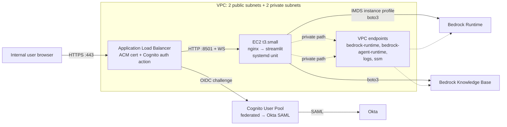

# Approach D — AWS EC2 single instance

> A single Linux VM in the org's AWS account, running Streamlit
> behind nginx, fronted by an Application Load Balancer with TLS and
> ALB-Cognito-Okta authentication. IAM via instance profile.

## TL;DR

The most transparent AWS-native deployment. Every component is a thing
you can SSH into, `journalctl` against, or curl directly. Cheap, easy
to reason about, satisfies all the security requirements. The cost is
that you own OS patching, deploys, and process supervision. For a
single-engineer demo this is fine. For the production trajectory in
[`../01-context.md` §1.2](../01-context.md), App Runner (F) or Fargate
(G) are lower-ops.

**Verdict for this demo:** A solid choice if the team prefers VMs to
containers, or wants something easy to debug. Otherwise (F) edges it
out on ops effort.

## Architecture



Key choices:

- **EC2 in a private subnet** with no public IP. The ALB lives in
  public subnets and is the only ingress.
- **VPC endpoints** for `bedrock-runtime`, `bedrock-agent-runtime`,
  `logs`, `ssm`, `ssmmessages`, `ec2messages` so the instance has
  zero NAT traffic and zero internet egress for normal operation.
  This is the same posture you want in production.
- **SSM Session Manager** for shell access — no SSH key pair, no port 22.
- **systemd** supervises the Streamlit process.

## Setup walkthrough

### D.1 One-time AWS prerequisites

- A VPC with 2 public + 2 private subnets across 2 AZs (a default
  VPC will do for the demo; production should use a curated one).
- An ACM certificate for `rag-demo.corp.example.com` in the same
  region.
- A Route 53 hosted zone or external DNS for `corp.example.com`.
- A Cognito User Pool with an Okta SAML identity provider — see
  [`../03-authentication.md`](../03-authentication.md) for the full
  config.
- ECR is *not* needed for this approach.

### D.2 Provision

Terraform sketch (illustrative — do not copy verbatim without
review):

```hcl
resource "aws_security_group" "alb" {
  name   = "rag-demo-alb"
  vpc_id = var.vpc_id
  ingress { from_port=443 to_port=443 protocol="tcp" cidr_blocks=["0.0.0.0/0"] }
  egress  { from_port=0   to_port=0   protocol="-1"  cidr_blocks=["0.0.0.0/0"] }
}

resource "aws_security_group" "app" {
  name   = "rag-demo-app"
  vpc_id = var.vpc_id
  ingress {
    from_port       = 8501
    to_port         = 8501
    protocol        = "tcp"
    security_groups = [aws_security_group.alb.id]
  }
  egress { from_port=0 to_port=0 protocol="-1" cidr_blocks=["0.0.0.0/0"] }
}

resource "aws_iam_role" "ec2" {
  name               = "rag-demo-ec2"
  assume_role_policy = data.aws_iam_policy_document.ec2_trust.json
}

resource "aws_iam_role_policy_attachment" "ssm" {
  role       = aws_iam_role.ec2.name
  policy_arn = "arn:aws:iam::aws:policy/AmazonSSMManagedInstanceCore"
}

resource "aws_iam_role_policy" "bedrock" {
  role   = aws_iam_role.ec2.id
  policy = data.aws_iam_policy_document.bedrock_demo.json
}

resource "aws_iam_instance_profile" "ec2" {
  name = "rag-demo-ec2"
  role = aws_iam_role.ec2.name
}

resource "aws_instance" "app" {
  ami                    = data.aws_ami.al2023.id
  instance_type          = "t3.small"
  subnet_id              = var.private_subnet_id
  vpc_security_group_ids = [aws_security_group.app.id]
  iam_instance_profile   = aws_iam_instance_profile.ec2.name
  user_data              = file("${path.module}/userdata.sh")

  metadata_options {  # IMDSv2 only
    http_tokens   = "required"
    http_endpoint = "enabled"
  }
}

resource "aws_lb" "alb" {
  name               = "rag-demo"
  load_balancer_type = "application"
  subnets            = var.public_subnet_ids
  security_groups    = [aws_security_group.alb.id]
}

resource "aws_lb_target_group" "tg" {
  name        = "rag-demo"
  port        = 8501
  protocol    = "HTTP"
  vpc_id      = var.vpc_id
  target_type = "instance"
  health_check { path = "/_stcore/health" matcher = "200" }
  stickiness  { type = "lb_cookie" enabled = true cookie_duration = 86400 }
}

resource "aws_lb_listener" "https" {
  load_balancer_arn = aws_lb.alb.arn
  port              = 443
  protocol          = "HTTPS"
  certificate_arn   = var.acm_arn
  ssl_policy        = "ELBSecurityPolicy-TLS13-1-2-2021-06"

  default_action {
    type = "authenticate-cognito"
    authenticate_cognito {
      user_pool_arn       = aws_cognito_user_pool.demo.arn
      user_pool_client_id = aws_cognito_user_pool_client.alb.id
      user_pool_domain    = aws_cognito_user_pool_domain.demo.domain
      session_timeout     = 28800
      scope               = "openid email profile"
      on_unauthenticated_request = "authenticate"
    }
    order = 1
  }
  default_action {
    type             = "forward"
    target_group_arn = aws_lb_target_group.tg.arn
    order            = 2
  }
}
```

The `userdata.sh` installs Python, clones the repo, drops a systemd
unit, starts the service:

```bash
#!/bin/bash
set -euxo pipefail
dnf install -y python3.11 python3.11-pip git
useradd --system --create-home --shell /usr/sbin/nologin streamlit

sudo -u streamlit bash <<'EOS'
cd ~
git clone https://github.com/<org>/<repo>.git app
cd app
python3.11 -m venv .venv
.venv/bin/pip install -r requirements.txt
EOS

cat >/etc/systemd/system/streamlit.service <<'EOF'
[Unit]
Description=RAG Streamlit demo
After=network.target

[Service]
User=streamlit
WorkingDirectory=/home/streamlit/app
Environment="AWS_REGION=us-east-1"
ExecStart=/home/streamlit/app/.venv/bin/streamlit run app.py \
  --server.port 8501 --server.address 127.0.0.1 \
  --server.enableXsrfProtection true \
  --server.enableCORS false
Restart=always
RestartSec=5

[Install]
WantedBy=multi-user.target
EOF

systemctl daemon-reload
systemctl enable --now streamlit
```

(nginx in front of Streamlit is optional on a single instance — the ALB
already terminates TLS and forwards WS upgrades. Skip nginx unless you
want host-level rate limiting.)

### D.3 First deploy / redeploy

- First deploy: `terraform apply`.
- Subsequent code deploys, two options:
  - **Pull-based:** SSM Run Command → `cd /home/streamlit/app && git
    pull && systemctl restart streamlit`. Trivial; mid-request users
    get reconnected.
  - **AMI-bake:** EC2 Image Builder bakes a new AMI; ASG (if you add
    one) rolls. Overkill for the demo.

### D.4 Tear-down

`terraform destroy`. ALB, EC2, Cognito pool, log groups, security
groups all go.

## Authentication integration

See [`../03-authentication.md`](../03-authentication.md). Summary:

- ALB listener has `authenticate-cognito` action **before** the
  forward action.
- Cognito User Pool has Okta as a SAML IdP.
- ALB injects `x-amzn-oidc-data` (a signed JWT) into every request to
  the target. Streamlit reads it to know the user.

## Networking and security

- ALB in public subnets, EC2 in private subnets.
- SG layering: ALB-SG accepts 443 from internet; App-SG accepts 8501
  only from ALB-SG.
- Outbound from EC2: only to VPC endpoints (Bedrock, logs, ssm). No
  NAT, no internet egress.
- IMDSv2 enforced.
- ALB access logs to S3, ALB metrics in CloudWatch.

## AWS credentials / IAM

EC2 instance profile holds the demo role. App calls Bedrock via
`boto3.client("bedrock-runtime")` with no explicit credentials —
IMDS provides them. Policy is the minimal one from
[`local-tunnel.md`](./local-tunnel.md#aws-credentials--iam) attached
to the instance role.

## Cost (us-east-1, demo workload)

| Item                                | Monthly                  |
| ----------------------------------- | ------------------------ |
| 1× `t3.small` (730 h)               | ~$15                     |
| 1× ALB (730 h + small LCU)          | ~$18 + ~$5 LCU = ~$23    |
| 1× ACM cert                         | $0                       |
| Cognito (< 50 MAU)                  | $0 (free tier)           |
| VPC endpoints (4 × $7.30)           | ~$30                     |
| CloudWatch logs                     | ~$1                      |
| **Total hosting**                   | **~$70 / month**         |
| AWS Bedrock                         | usage-based, separate    |

(VPC endpoints are optional for a demo — if egress is allowed via NAT,
you save ~$30/mo at the cost of mixing public-internet egress with
private-VPC posture.)

## Scaling characteristics

- One instance handles ~10–20 concurrent Streamlit sessions
  comfortably on `t3.small`. Step up to `t3.medium` if needed.
- **Vertical** scaling only. No autoscaling group in this design (a
  single Streamlit process can't be horizontally scaled without an
  external session store).
- Restarts are not graceful; in-flight WebSockets drop and reconnect.

## Operability

- **Shell access:** `aws ssm start-session --target i-…`.
- **Logs:** `journalctl -u streamlit -f` on box; CloudWatch agent ships
  to a log group `/rag-demo/app`.
- **Deploys:** SSM Run Command with the git-pull script above.
- **Patching:** SSM Patch Manager monthly window, or simply bake a new
  AMI before launching the production version.
- **Backups:** none needed (stateless).
- **Monitoring:** CloudWatch alarms on instance CPU > 80%, status check
  failures, ALB `HTTPCode_Target_5XX_Count`.

## Pros

- **Everything is debuggable.** SSH, ps, top, journalctl all work.
- **Cheap.** ~$70/mo all-in.
- **Strong security posture:** private subnet, IAM role, VPC endpoints.
- **WebSockets and long timeouts** are native to ALB.
- **No container build pipeline required.**

## Cons

- **OS patching is your job** (SSM Patch Manager helps but still your
  job).
- **Single instance = SPOF.** Acceptable for a demo, not for prod.
- **Manual deploy step** (SSM Run Command or rerun Terraform with new
  user-data hash).
- **No image artifact** — what's running is whatever the box pulled.
  Reproducibility relies on the user-data script + the git SHA.
- **Vertical scaling only** in this design.

## When to pick this

- Team is more comfortable with VMs than with containers.
- Want the cheapest AWS-native demo and don't mind a little hand-on
  ops.
- Need to keep the platform option open to install arbitrary OS-level
  tooling (e.g. system-level Python libraries that don't containerize
  easily).

If the team is happy with containers, jump to (F) App Runner — same
security posture, lower ops cost.
