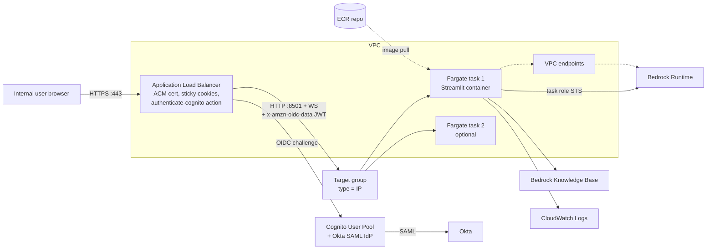

# Approach G — AWS ECS Fargate behind ALB (Cognito + Okta)

> A container running on Fargate inside the org's VPC, fronted by an
> Application Load Balancer that performs **Cognito user-pool
> authentication federated to Okta** before forwarding to the app.
> IAM via ECS task role. The most production-shaped option in this
> document.

## TL;DR

Architecturally, this is the answer if the demo will graduate to
production with the same shape. ALB-Cognito-Okta is the standard
AWS pattern for putting an authenticated web app in front of an
internal audience; ECS Fargate gives you containers without managing
nodes; task roles solve the IAM-without-static-keys problem cleanly.
The trade-off vs. App Runner (F) is that you provision ~10 AWS
resources instead of ~3, and the deploy lifecycle now involves
service definitions, task definitions, and target groups.

**Verdict for this demo:** Recommended if (a) the org has Terraform/CDK
already, or (b) the demo is explicitly the v0 of the production
deployment. Otherwise (F) is faster to ship.

## Architecture



## Setup walkthrough

### G.1 Resources to create

1. **VPC bits**
   - 2 public subnets (for ALB)
   - 2 private subnets (for tasks)
   - NAT optional if VPC endpoints cover egress
   - VPC endpoints: `bedrock-runtime`, `bedrock-agent-runtime`,
     `ecr.api`, `ecr.dkr`, `s3` (gateway), `logs`, `secretsmanager`
2. **ACM certificate** for `rag-demo.corp.example.com`
3. **Cognito User Pool**
   - Domain: `rag-demo.auth.us-east-1.amazoncognito.com`
   - App client: ALB integration, callback URL
     `https://rag-demo.corp.example.com/oauth2/idpresponse`
   - Okta added as SAML IdP — see
     [`../03-authentication.md`](../03-authentication.md)
4. **ECR repository** `rag-demo`
5. **ECS cluster** (Fargate, no EC2 capacity providers)
6. **Task definition**
   - `awsvpc` network mode
   - 1 container: 1 vCPU / 2 GB → scalable
   - Task role with Bedrock policy
   - Task execution role with ECR + logs permissions
   - `essential: true` health check on
     `curl -fsS http://localhost:8501/_stcore/health`
   - Log driver `awslogs` → `/ecs/rag-demo`
7. **ECS service**
   - `desiredCount: 1` for demo
   - `deploymentConfiguration`: `minimumHealthyPercent: 100`,
     `maximumPercent: 200` for rolling deploys
   - Attached to the target group below
   - Service connect optional
8. **ALB + listener + target group**
   - Target group `type: ip`, port 8501,
     stickiness `lb_cookie` enabled, 1 day
   - Health check on `/_stcore/health`
   - Listener 443 with two-action rule:
     1. `authenticate-cognito`
     2. `forward` to target group
9. **DNS** — Route 53 alias from
   `rag-demo.corp.example.com` to the ALB.
10. **Optional: WAF** with an `AWSManagedRulesCommonRuleSet` web ACL
    on the ALB.

### G.2 Terraform layout (suggested)

```
infra/
  envs/demo/
    main.tf                # module composition
    variables.tf
    outputs.tf
    terraform.tfvars
  modules/
    network/               # VPC, subnets, endpoints
    cognito_okta/          # user pool, IdP, app client, domain
    alb/                   # ALB, listener, TG, cert binding
    ecs_service/           # cluster, task def, service
    ecr_repo/
```

This is the layout the same templates will reuse for prod by
swapping `envs/demo` for `envs/prod`.

### G.3 First deploy

```bash
cd infra/envs/demo
terraform init
terraform apply

aws ecr get-login-password | docker login --username AWS \
  --password-stdin <acct>.dkr.ecr.us-east-1.amazonaws.com
docker build -t rag-demo:0.1.0 .
docker tag rag-demo:0.1.0 <acct>.dkr.ecr.us-east-1.amazonaws.com/rag-demo:0.1.0
docker push <acct>.dkr.ecr.us-east-1.amazonaws.com/rag-demo:0.1.0

aws ecs update-service \
  --cluster rag-demo \
  --service rag-demo \
  --force-new-deployment
```

### G.4 Streamlit + ALB Cognito header plumbing

The ALB injects four headers into every forwarded request:

- `x-amzn-oidc-data` — signed JWT with the user claims
- `x-amzn-oidc-identity` — user `sub`
- `x-amzn-oidc-accesstoken` — Cognito access token
- `x-amzn-oidc-data` is JWS-signed with an ALB-specific public key
  (key id in the JWT header, key served from a region-specific URL)

In Streamlit:

```python
import json, base64, requests
from jose import jwt  # python-jose
import streamlit as st

def current_user():
    raw = st.context.headers.get("x-amzn-oidc-data")
    if not raw:
        return None
    header = json.loads(base64.urlsafe_b64decode(raw.split(".")[0] + "=="))
    kid = header["kid"]
    region = header.get("alg") and "us-east-1"  # in practice read from env
    key_url = f"https://public-keys.auth.elb.{region}.amazonaws.com/{kid}"
    pubkey = requests.get(key_url, timeout=3).text
    claims = jwt.decode(raw, pubkey, algorithms=["ES256"])
    return claims  # email, sub, etc.
```

Validate, do not trust headers blindly: the same target group could in
principle receive requests bypassing the ALB if the security group is
misconfigured. Lock the SG so the target only accepts traffic from the
ALB SG, then `x-amzn-oidc-data` is trustworthy by construction.

## Authentication integration

Native. The ALB enforces auth before any byte reaches the app. See
[`../03-authentication.md`](../03-authentication.md) for the full
Cognito + Okta SAML walk-through, including:

- Okta SAML app metadata
- Cognito user pool SAML IdP attribute mapping (`email`, `given_name`,
  `family_name`)
- Cognito app client for the ALB
- ALB listener rule

This is the canonical AWS pattern and is what production should use.

## Networking and security

- ALB in public subnets, tasks in private subnets.
- ALB SG: 443 from internet only.
- Task SG: 8501 from ALB SG only.
- VPC endpoints carry all AWS traffic; no NAT gateway needed if all
  required services have endpoints.
- IMDSv2 not relevant (Fargate uses task metadata v2).
- WAF web ACL recommended.
- Secrets via Secrets Manager referenced from the task definition.

## AWS credentials / IAM

Two roles:

- **Task execution role** — pulls the image, writes to CloudWatch
  Logs, reads referenced secrets. `AmazonECSTaskExecutionRolePolicy`
  plus `secretsmanager:GetSecretValue` on the demo secret.
- **Task role** — assumed *by the container*. This is where Bedrock
  + KB permissions live. Same minimal policy as
  [`local-tunnel.md`](./local-tunnel.md#aws-credentials--iam).

The container code calls `boto3` with no explicit credentials. The
SDK reads `AWS_CONTAINER_CREDENTIALS_RELATIVE_URI` and hits the
Fargate credential endpoint.

## Cost (us-east-1, demo workload)

| Item                                            | Monthly                |
| ----------------------------------------------- | ---------------------- |
| Fargate task: 1 vCPU + 2 GB × 730 h             | ~$36                   |
| ALB                                             | ~$23                   |
| VPC endpoints (5 × $7.30)                       | ~$37                   |
| ACM cert                                        | $0                     |
| Cognito (< 50 MAU)                              | $0                     |
| CloudWatch logs (~5 GB)                         | ~$3                    |
| ECR storage                                     | ~$1                    |
| Route 53 hosted zone                            | $0.50                  |
| **Total hosting**                               | **~$100 / month**      |
| AWS Bedrock                                     | usage-based, separate  |

A penny-pinching demo can drop VPC endpoints and NAT (egress via
NAT gateway, ~$32/mo + data) for similar money but worse posture.
Recommended to keep endpoints — same shape as prod.

Cost can be cut by ~50% with **Fargate Spot** for the demo only.

## Scaling characteristics

- Horizontal scaling via `desiredCount` and an Application Auto
  Scaling policy on ALB request count per target.
- ALB **sticky sessions** (`lb_cookie`) keep a user pinned to the
  same task, which makes Streamlit's in-memory session state work
  across replicas — within the same task. If a task is replaced
  mid-session, that user's state is lost. Acceptable for a demo.
- Long-term, externalize session state to Redis (ElastiCache) or
  DynamoDB so tasks become truly stateless and scaling is free.
- ALB request timeout default is 60 s; bump to 600+ s on the
  listener attribute (`routing.http.streaming.enabled` and
  `idle_timeout`) for long agentic responses streaming over WS.

## Operability

- **Logs:** CloudWatch Logs `/ecs/rag-demo`, one stream per task.
- **Metrics:** ECS service metrics, ALB target metrics, container
  insights (optional, adds cost).
- **Shell access:** ECS Exec (`aws ecs execute-command --container ...
  --command "/bin/sh" --interactive`).
- **Deploys:** push to ECR, `update-service --force-new-deployment`
  for rolling, or use CodeDeploy blue/green wired to the target group
  for prod-grade deploys.
- **Rollback:** redeploy previous image tag.
- **Tear-down:** `terraform destroy` of the env module.

## Pros

- **Production-shaped** — same architecture is appropriate for the
  real launch, with autoscaling, multi-AZ, and a load balancer that
  already does identity-aware auth.
- **Native ALB Cognito + Okta SAML.** Strongest auth posture without
  a Lambda@Edge dance.
- **IAM task role.** Best credential model.
- **WebSockets, sticky sessions, long idle timeouts** all first-class
  on ALB.
- **Private VPC path to Bedrock** via VPC endpoints.
- **Same image runs on App Runner** if you decide to simplify ops.

## Cons

- **More resources to provision** than (F). 10+ AWS objects vs. 3.
- **Higher fixed cost** at idle (~$100/mo) vs. App Runner (~$40/mo).
- **More to learn / debug** for someone new to ECS: task def
  versions, service events, target group health, capacity providers.
- **Streamlit session state still single-task** until externalized.

## When to pick this

- The demo is **explicitly v0 of production** and you want the same
  architecture to evolve, not be replaced.
- The org already invests in ECS Fargate; team familiarity exists.
- You need ALB-Cognito-Okta auth without an additional CDN/proxy
  layer.

If "ship the demo fast and we'll rebuild for prod later" is the
mindset, (F) is the better answer.

## Why not EKS for the demo

Considered and rejected:

- **EKS control plane** costs $0.10/h ≈ $73/mo *before* any workload.
- **Cluster ops** (upgrades, node groups, addons, ingress controllers,
  IRSA) require ongoing attention that a 1-engineer demo cannot
  amortize.
- **Equivalent capabilities** to ECS Fargate at this scale, but with
  more moving parts (CNI, kube-proxy, CoreDNS, ingress controller).
- **No second workload to share the cluster with**, so the per-pod
  cost is the worst case.

If the org standardizes on Kubernetes for production, the demo image
will run on EKS unchanged when that time comes — there is nothing
container-shape-specific learned from running it on Fargate first.
