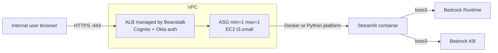

# Approach E — AWS Elastic Beanstalk

> A managed wrapper around EC2 + Auto Scaling Group + ALB +
> CloudWatch. Deploy a Python app or Docker image with a single
> `eb deploy` command. Conceptually it is "managed EC2".

## TL;DR

Elastic Beanstalk lands between raw EC2 (D) and App Runner (F) on the
managed-ness axis. It still uses EC2 under the hood, but you do not
hand-roll the instance, ALB, target group, or systemd unit. It is a
reasonable choice if the org already runs Beanstalk apps and has
opinionated templates for it. As a *new* tool to learn for a single
demo it is not worth it — App Runner gives more managed-ness for less
ceremony.

**Verdict for this demo:** Pick this only if the org already has a
Beanstalk playbook. Otherwise skip in favor of (F) or (G).

## Architecture



The "platform" can be either:

- **Python managed platform** (Amazon Linux 2023 + Python 3.11). EB
  installs `requirements.txt`, runs a Procfile.
- **Docker platform** (Amazon Linux 2023). EB builds/runs your
  Dockerfile or pulls from ECR.

For Streamlit the Docker platform is cleaner — the Python platform
defaults assume WSGI (gunicorn), which does not fit Streamlit's
WebSocket model without overrides.

## Setup walkthrough (Docker platform)

1. Add a `Dockerfile` (same as in Approach C).
2. Add a `.platform/nginx/conf.d/websocket.conf` to allow WS upgrades
   through the EB-managed nginx:
   ```
   location /_stcore/stream {
     proxy_pass          http://docker;
     proxy_http_version  1.1;
     proxy_set_header    Upgrade $http_upgrade;
     proxy_set_header    Connection "upgrade";
     proxy_read_timeout  3600s;
   }
   ```
3. Add `Dockerrun.aws.json`:
   ```json
   {
     "AWSEBDockerrunVersion": "1",
     "Ports": [{ "ContainerPort": 8501 }]
   }
   ```
4. Initialize and deploy:
   ```bash
   eb init -p docker rag-demo --region us-east-1
   eb create rag-demo-env \
     --instance-type t3.small \
     --vpc.id $VPC --vpc.ec2subnets $PRIVA,$PRIVB \
     --vpc.elbsubnets $PUBA,$PUBB --vpc.elbpublic \
     --enable-spot false \
     --single
   ```
   (`--single` skips the ASG and uses a single EC2; flip for prod.)
5. Configure the ALB listener for HTTPS + Cognito via `.ebextensions`
   or the EB console (Beanstalk does not have first-class Cognito
   integration like raw ALB does, but you can attach the
   authenticate-cognito action to the EB-managed listener
   post-creation).
6. Set environment variables (`eb setenv KB_ID=… MODEL_ID=…`).

## Authentication integration

Same as (D) — ALB listener `authenticate-cognito` → Cognito → Okta.
The difference is that Beanstalk owns the ALB, so changes must be made
either via `.ebextensions` resource overrides or accepted as
out-of-band edits.

## Networking and security

Same as (D): public subnets for ALB, private subnets for EC2, VPC
endpoints, IMDSv2 enforced.

## AWS credentials / IAM

Beanstalk creates two roles:

- **Service role** (`aws-elasticbeanstalk-service-role`) — for EB to
  manage AWS resources on your behalf.
- **Instance profile** (`aws-elasticbeanstalk-ec2-role`) — attach the
  Bedrock policy here. The app uses `boto3` with no explicit creds.

## Cost

Same order of magnitude as (D). Beanstalk itself is free; you pay for
the underlying EC2 + ALB + (optionally) CloudWatch enhanced metrics.

| Item                          | Monthly             |
| ----------------------------- | ------------------- |
| EC2 t3.small                  | ~$15                |
| ALB                           | ~$23                |
| VPC endpoints (optional)      | ~$30                |
| Enhanced health (optional)    | ~$0–$5              |
| **Total**                     | **~$70–$75 / mo**   |

## Scaling characteristics

- Beanstalk supports an ASG, so horizontal scaling is one config flag
  away — but Streamlit's in-memory session state means two replicas
  require sticky sessions (which the EB ALB supports). Still fine for
  a demo.
- Rolling deploys are built in (`Rolling`, `Immutable`, `Blue/Green`
  via swap).

## Operability

- `eb deploy` for new versions.
- `eb logs` tails CloudWatch logs.
- `eb ssh` (or SSM) for shell access.
- Application Versions are kept as zipped artifacts in an S3 bucket
  Beanstalk creates — proper rollback by selecting an older version.
- Enhanced health reporting is genuinely useful.

## Pros

- **Rolling / blue-green deploys** are first-class.
- **Application versions** kept as artifacts; rollback is a button.
- **ASG + ALB** are wired up for you.
- **Logs and health** in one console view.

## Cons

- **Two new vocabularies to learn** (Beanstalk envs, application
  versions) on top of the AWS primitives.
- **`.ebextensions` / `.platform` hooks** are an acquired taste and
  badly documented for niche cases like Streamlit WebSockets.
- **Cognito integration is bolt-on** rather than declarative.
- **Heavier than App Runner** for an equivalent outcome.
- Beanstalk is **not where AWS is investing** new features — App
  Runner, ECS, and Lambda are getting attention; Beanstalk is in
  steady-state.

## When to pick this

- Org already has a Beanstalk template you can fork.
- Need EB-specific features (e.g. worker tiers, scheduled tasks via
  SQS-backed environments) that the demo's siblings will reuse.
- Otherwise prefer App Runner (F) or Fargate (G).
