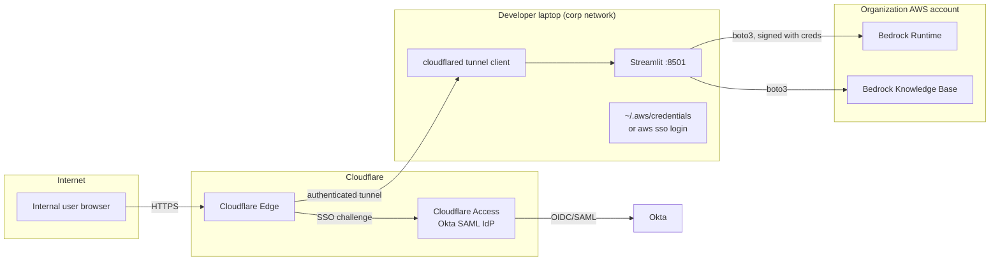

# Approach A — Local laptop + secure tunnel

> Run Streamlit on the developer's laptop exactly like today, then expose
> it to the rest of the organization through a **Cloudflare Tunnel** (or
> ngrok) protected by **Cloudflare Access** (or ngrok's OAuth gate).

## TL;DR

This is the *fastest possible* way to put the prototype in front of
internal users — minutes, not hours. It is appropriate for an
hours-to-days "show three colleagues" demo. It is **not** appropriate
for an org-wide multi-week test, because the laptop becomes a SPOF,
AWS credentials live on a personal machine, and there is no path to a
clean tear-down or to scaling.

**Verdict for this demo:** Use only as a temporary stop-gap if there is
external pressure to demo *today* and the proper AWS deployment is
still being provisioned.

## Architecture



Cloudflare Tunnel does *not* require opening any inbound port on the
laptop. The tunnel client (`cloudflared`) makes an outbound persistent
connection to Cloudflare's edge; the edge accepts user traffic, applies
the Access policy, and forwards through the tunnel. ngrok has the same
shape, with `ngrok` instead of `cloudflared` and ngrok's own SSO add-on
instead of Cloudflare Access.

## Setup walkthrough

### A.1 Prereqs

- A Cloudflare account on a domain you control (e.g. `corp.example.com`)
  *or* an `*.trycloudflare.com` quick-tunnel (unauthenticated, dev only).
- Okta admin willing to add a SAML/OIDC app for Cloudflare Access
  (15 min of their time). If not, Cloudflare Access can also gate on
  *email domain* with one-time PIN — useful as a stop-gap.
- The laptop must keep running and stay on a network that allows
  outbound HTTPS to `*.cloudflare.com`.

### A.2 Steps

1. Make the Streamlit app survive a reboot:
   ```bash
   pipx install streamlit  # or use a venv
   # add to login items / launchd / a tmux session
   streamlit run app.py --server.address 127.0.0.1 --server.port 8501
   ```
2. Install `cloudflared`:
   ```bash
   brew install cloudflared          # macOS
   # or download from cloudflare.com/products/tunnel
   cloudflared tunnel login
   cloudflared tunnel create rag-demo
   cloudflared tunnel route dns rag-demo rag-demo.corp.example.com
   ```
3. Write `~/.cloudflared/config.yml`:
   ```yaml
   tunnel: rag-demo
   credentials-file: /Users/me/.cloudflared/<UUID>.json
   ingress:
     - hostname: rag-demo.corp.example.com
       service: http://127.0.0.1:8501
       originRequest:
         noTLSVerify: false
         connectTimeout: 30s
     - service: http_status:404
   ```
4. Run the tunnel as a service:
   ```bash
   sudo cloudflared service install
   ```
5. In the Cloudflare Zero Trust dashboard, create an **Access
   Application** for `rag-demo.corp.example.com`:
   - Identity provider: Okta (SAML or OIDC)
   - Policy: `Allow` if email ends with `@corp.example.com`
   - Session duration: 8 h
6. Test from a colleague's laptop. They should hit the Cloudflare
   Access login, authenticate against Okta, then see the Streamlit UI.

### A.3 AWS credentials on the laptop

Use AWS SSO, not static keys:

```bash
aws configure sso        # one-time
aws sso login --profile rag-demo
export AWS_PROFILE=rag-demo
streamlit run app.py
```

The IAM permission set should be **read-only Bedrock + Knowledge Base
retrieve**, scoped to the specific KB ARN.

## Authentication integration

- **Cloudflare Access ↔ Okta:** SAML or OIDC, configured in Okta as a
  generic SAML app. Cloudflare forwards a `Cf-Access-Authenticated-User-Email`
  header to the origin, which the Streamlit app can read to identify
  the user.
- **ngrok equivalent:** ngrok Edge with OAuth → Okta. Same model.
- **Stop-gap if Okta is not ready:** Cloudflare Access "One-time PIN"
  policy — users enter their `@corp.example.com` email, receive a code,
  log in. Works for a few-day window.

## Networking and security

- TLS is terminated by Cloudflare; the tunnel itself is encrypted.
- The laptop never opens an inbound port.
- **Risk:** AWS credentials are on a personal machine. If the laptop is
  lost or compromised, those credentials must be revoked. Use SSO so the
  blast radius is a short-lived token, not a permanent key.
- **Risk:** All traffic to Bedrock egresses from the laptop's residential
  / corp network, not from AWS. CloudTrail will show the API calls but
  the source IP is the laptop, which makes audit weird.
- **Risk:** No DR. Laptop sleeps → demo dies.

## AWS credentials / IAM

- Local `aws sso login` with a permission set named e.g.
  `BedrockRAGDemoUser`:
  ```json
  {
    "Version": "2012-10-17",
    "Statement": [
      {
        "Effect": "Allow",
        "Action": [
          "bedrock:InvokeModel",
          "bedrock:InvokeModelWithResponseStream"
        ],
        "Resource": "arn:aws:bedrock:us-east-1::foundation-model/anthropic.claude-3-sonnet-*"
      },
      {
        "Effect": "Allow",
        "Action": [
          "bedrock-agent-runtime:Retrieve",
          "bedrock-agent-runtime:RetrieveAndGenerate"
        ],
        "Resource": "arn:aws:bedrock:us-east-1:<acct>:knowledge-base/<KB_ID>"
      }
    ]
  }
  ```
- Do not paste long-lived access keys into `.env` or `secrets.toml`.

## Cost

| Item                          | Monthly                        |
| ----------------------------- | ------------------------------ |
| Cloudflare Tunnel             | $0                             |
| Cloudflare Access (≤ 50 users)| $0 (Free Zero Trust tier)      |
| Compute (the laptop)          | $0 incremental                 |
| AWS Bedrock                   | usage-based, separate          |

Effectively free for the demo window.

## Scaling characteristics

- **One user:** great.
- **Five concurrent users:** fine, Streamlit handles it; laptop fans
  spin up under model streaming load.
- **Twenty concurrent users:** likely degraded — Streamlit's single
  process becomes a bottleneck, and the laptop's network/CPU is not
  designed for this.
- **Restart / version bump:** kill the process and restart; the tunnel
  reconnects automatically, but in-flight users get disconnected with
  no graceful drain.

## Operability

- Logs: Streamlit's stdout in a terminal. Easy to lose.
- Metrics: none.
- Deploys: `git pull && pkill streamlit && streamlit run app.py`.
- Backups / rollback: git.
- Tear-down: stop `cloudflared`, remove the DNS record, revoke the
  Cloudflare Access app.

## Pros

- **Fastest** path to a working URL behind SSO. < 1 hour from zero.
- **No AWS infra** to provision, so nothing to clean up in AWS later.
- **Native WebSockets** through Cloudflare Tunnel.
- **Cheap** — free at this scale.
- **Easy to throw away** when the real deployment is ready.

## Cons

- **Laptop is a SPOF.** Closing the lid kills the demo.
- **AWS credentials on a personal machine** — even with SSO, this is a
  weaker posture than an IAM role attached to a workload.
- **No real path to production.** Everything you build here gets thrown
  away.
- **Confusing audit trail** — Bedrock calls originate from a residential
  IP.
- **Single replica only.** No graceful upgrades.

## When to pick this

- The demo needs to happen **this afternoon**.
- The audience is **3–10 trusted colleagues**, not the whole org.
- You are *also* in parallel provisioning a real AWS deployment, and
  this is a bridge.

If any of those is false, skip this and go to (F) or (G).
