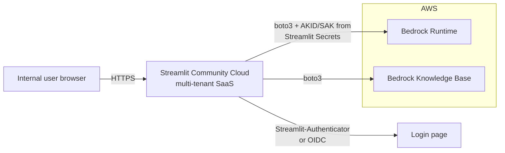

# Approach B — Streamlit Community Cloud

> Push the repo to GitHub, click "Deploy" on
> [share.streamlit.io](https://share.streamlit.io/), get a TLS URL at
> `https://<app>.streamlit.app/`.

## TL;DR

This is the path Streamlit's own marketing optimizes for. It is the
*easiest* deploy in raw clicks. For *this* app it has one hard
disqualifier: there is no way to give the running app an AWS IAM role,
so authenticating to Bedrock requires a long-lived AWS access key
stored in Streamlit Secrets — which violates the security requirement
in [`../01-context.md` §1.4.1](../01-context.md). Documented here in
detail so the trade-off is explicit.

**Verdict for this demo:** Do **not** use unless the security team
explicitly accepts an IAM user with a static access key for the demo
window, and the key is scoped, rotated, and time-boxed.

## Architecture



The container running the app lives in Snowflake/Streamlit's
infrastructure. Outbound calls to AWS Bedrock are signed with a static
access key pair injected via environment variables from Streamlit
Secrets.

## Setup walkthrough

1. Push the repo to GitHub:
   - `requirements.txt` with `streamlit`, `boto3`, etc.
   - `streamlit_app.py` as the entrypoint.
2. Sign in to https://share.streamlit.io with the GitHub account.
3. Click **New app**, select the repo, branch, and entrypoint.
4. In **Advanced settings → Secrets**, paste:
   ```toml
   AWS_ACCESS_KEY_ID = "AKIA..."
   AWS_SECRET_ACCESS_KEY = "..."
   AWS_DEFAULT_REGION = "us-east-1"
   KB_ID = "ABC123XYZ"
   ```
5. Click Deploy. Wait ~3 minutes for the build.
6. The app is reachable at `https://<workspace>-<app>.streamlit.app/`.
7. (Optional) Add login:
   - **Streamlit's built-in OIDC login** (`st.login()` /
     `st.user`, available in recent versions) — supports Google,
     custom OIDC providers including Okta.
   - Or `streamlit-authenticator` with a YAML user list (not SSO).

## Authentication integration

- **Okta via OIDC:** Streamlit's `st.login` accepts an OIDC client
  configured in `secrets.toml`:
  ```toml
  [auth]
  redirect_uri = "https://<app>.streamlit.app/oauth2callback"
  cookie_secret = "..."
  client_id = "<okta-client-id>"
  client_secret = "<okta-client-secret>"
  server_metadata_url = "https://<org>.okta.com/.well-known/openid-configuration"
  ```
- **Streamlit-Authenticator:** username/password with hashed creds in
  YAML. Not SSO; acceptable as a stop-gap.
- **No way to do an identity-aware proxy** (no ALB, no Cloudflare
  Access in front of the *.streamlit.app domain unless you put the
  whole app behind a custom domain via reverse proxy, which Community
  Cloud doesn't natively support).

## Networking and security

- App is on the **public internet**, on a shared hostname.
- TLS is managed by Streamlit.
- **No VPC**, so Bedrock traffic traverses the public internet from
  Streamlit's infra to AWS regional endpoints. (Bedrock is reachable
  over public endpoints, so this works — but private VPC endpoints
  used by the production path are not available here.)
- **No IP allow-listing** on Bedrock side without a NAT-friendly
  alternative, because Streamlit Community Cloud egress IPs are not
  stable or documented.
- **CloudTrail will record API calls** from Streamlit's IPs against
  the IAM user. Source IP attribution is muddled.

## AWS credentials / IAM — *the disqualifier*

Community Cloud cannot assume an AWS IAM role. The only ways to give
the app access to Bedrock are:

1. **Static IAM user access key** pasted into Streamlit Secrets.
   - Long-lived credential on a SaaS we do not control.
   - Rotation requires re-pasting into the UI.
   - If leaked, exposes Bedrock budget and KB contents until detected.
2. **OIDC-federated role assumption** via the GitHub-Streamlit-AWS
   chain — but Community Cloud does not currently expose an OIDC
   identity token to the running app, so this is not implementable.

Even with the minimal-permission policy from
[`local-tunnel.md`](./local-tunnel.md), option 1 is materially worse
than every AWS-hosted approach below, because the secret exists at
all and can be exfiltrated by anything that gets read access to the
Streamlit dashboard.

If used anyway, the *minimum* mitigations are:

- IAM user with **only** `bedrock:InvokeModel*` and
  `bedrock-agent-runtime:Retrieve*` on the specific KB ARN.
- **MFA-not-required** but the user has **no console access**.
- Key rotated every 7 days during the demo window.
- AWS Budget alert at 1.2× expected monthly spend.
- Calendar reminder to **delete the IAM user** the day the demo ends.

## Cost

| Item                       | Monthly |
| -------------------------- | ------- |
| Streamlit Community Cloud  | $0      |
| AWS Bedrock                | usage   |

Free. The cost is paid in security posture.

## Scaling characteristics

- Community Cloud caps resources per app (≈ 1 GB RAM, 1 vCPU, shared
  CPU). Fine for ≤ 5 concurrent users.
- Apps **sleep** after a period of inactivity and cold-start on the
  next request — first hit can take 30+ seconds.
- No autoscaling; one replica.

## Operability

- **Logs:** in the Streamlit Cloud dashboard, retention is short.
- **Deploys:** push to the configured branch → auto-rebuild.
- **Rollback:** revert the commit. There is no separate "previous
  version" deploy artifact.
- **Tear-down:** click "Delete app" in the dashboard, then rotate /
  delete the IAM user in AWS.

## Pros

- **Cheapest** managed hosting that exists for Streamlit ($0).
- **Closest** to "click and go" — minutes from a GitHub push to a URL.
- **Streamlit-native** — no template, dockerfile, or proxy config.
- Built-in OIDC login (`st.login`).

## Cons

- **Static AWS access key required** — the deal-breaker.
- **Public hostname**, no IP allow-listing, no VPC.
- **App sleeps**, cold starts hurt the demo.
- **Resource limits** (1 vCPU / 1 GB) constrain Opus / long context
  windows in the future.
- **No path to production** — every step taken here is throw-away when
  the real deployment ships.

## When to pick this

- The user explicitly accepts the static-key risk, scoped tightly, for
  a demo measured in **days**.
- There is no AWS-side capacity (no account access, no IAM admin) to
  stand up even App Runner.
- The audience is tiny and is told this is a throwaway preview.

Otherwise, prefer (A) for a same-day need or (F)/(G) for a real demo.
