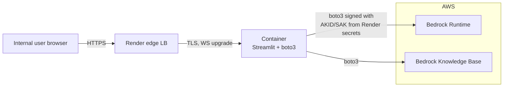

# Approach C — Third-party PaaS (Render / Fly.io / Hugging Face Spaces)

> Generic container/PaaS platforms outside AWS. Same shape as
> Streamlit Community Cloud (B), but more flexible runtimes and bigger
> resource limits. Same fundamental AWS-credentials problem.

## TL;DR

Render, Fly.io, and Hugging Face Spaces are all viable *Streamlit*
hosts — they run persistent containers, support WebSockets, and
deploy from GitHub or a Dockerfile. The blocker is the same as
Approach B: none of them can natively **assume an AWS IAM role** for
this app's region/account, so Bedrock access requires a long-lived
access key in their secret store. Documented as a complete option so
the trade-off is explicit.

**Verdict for this demo:** Not recommended. Prefer (A) for a same-day
demo and (F)/(G) for a multi-week demo.

## Architecture (Render shown; Fly/HF are isomorphic)



## Platform comparison at a glance

| Capability                              | Render Web Service   | Fly.io Machines      | Hugging Face Spaces (Streamlit SDK) |
| --------------------------------------- | -------------------- | -------------------- | ----------------------------------- |
| Persistent container                    | yes                  | yes                  | yes                                 |
| WebSocket support                       | yes                  | yes                  | yes                                 |
| Build from GitHub                       | yes                  | yes (via Dockerfile) | yes                                 |
| Deploy from prebuilt Docker image       | yes                  | yes                  | limited                             |
| Custom domain                           | yes                  | yes                  | paid tier                           |
| TLS                                     | managed              | managed              | managed                             |
| Private (non-public) by default         | paid tier            | paid tier            | paid ("Private Space")              |
| SSO / Okta in front of the app          | yes (paid Render Teams / Cloudflare Access in front) | DIY (Cloudflare Access in front) | HF Org SSO (paid) |
| AWS IAM role assumption (OIDC federation) | **no native**      | **no native**        | **no native**                       |
| Free tier                               | yes (sleeps)         | yes (capped hours)   | yes (public, CPU)                   |
| Typical paid plan for this workload     | $7–25 / mo           | $5–20 / mo           | $9 / mo (CPU Upgrade)               |

### Why "no native" matters

All three platforms accept "environment variables" / "secrets" — but none
of them mint short-lived AWS credentials for the workload. Some
workarounds exist in theory:

- **GitHub Actions OIDC → AWS STS → write the resulting session
  tokens into the platform's secret store on a schedule.** Doable, but
  the platform now holds a credential that is *valid right now*, and
  rotating it on a 1-hour cadence into Render/Fly's secret store
  requires an admin API + scheduled job. The complexity wipes out the
  "easy PaaS" advantage.
- **Run a tiny sidecar that calls AWS STS from the container using a
  long-lived key, then rotates a short-lived key internally.** This
  just relocates the long-lived key.

The honest summary: on these platforms there is always a long-lived
AWS secret at the bottom of the credential chain.

## Setup walkthrough (Render shown)

1. Add a `Dockerfile` to the repo:
   ```dockerfile
   FROM python:3.11-slim
   WORKDIR /app
   COPY requirements.txt .
   RUN pip install --no-cache-dir -r requirements.txt
   COPY . .
   EXPOSE 8501
   CMD ["streamlit", "run", "app.py", "--server.port=8501", "--server.address=0.0.0.0"]
   ```
2. On Render, create a **Web Service**, point it at the repo, pick a
   plan that does not sleep (Starter / Standard).
3. Add environment variables:
   - `AWS_ACCESS_KEY_ID`, `AWS_SECRET_ACCESS_KEY`, `AWS_DEFAULT_REGION`
   - `KB_ID`, `MODEL_ID`
4. (Optional) Put **Cloudflare Access** in front by:
   - Pointing `rag-demo.corp.example.com` at the Render service via a
     CNAME flattened through Cloudflare.
   - Creating an Access app on that hostname → Okta SAML.
5. Test from a colleague's network.

Fly.io is the same shape with `fly launch && fly deploy`.

Hugging Face Spaces is even simpler if the app is public, but for an
internal demo you must use a **Private Space** in an org, which means
HF Org SSO (paid) or `Cloudflare Access` cannot wrap it because the HF
hostname is fixed.

## Authentication integration

- **Cloudflare Access in front (recommended if going this route).**
  Same model as in (A). Render/Fly support custom domains, so attach
  `rag-demo.corp.example.com`, gate it with Cloudflare Access → Okta.
- **In-app `st.login` / Streamlit-Authenticator.** Same as (B).
- **Hugging Face Org SSO.** Built in, paid tier. Limits the user pool
  to people who have HF accounts in your org — adds friction.

## Networking and security

- Public hostnames on platform-owned domains by default.
- Egress to AWS Bedrock is over the public internet from whatever
  region the platform runs in (Render: Oregon / Frankfurt / Singapore;
  Fly: many regions; HF: AWS us-east-1 typically).
- No VPC peering / no PrivateLink path to AWS.
- Secrets storage is the platform's KV store. Treat it like a SaaS
  secret — auditable but not as good as KMS-backed Secrets Manager.

## AWS credentials / IAM

Same as (B): a long-lived IAM user, scoped to Bedrock + the specific
KB, key rotated frequently, deleted at end of demo. See
[`streamlit-community-cloud.md`](./streamlit-community-cloud.md#aws-credentials--iam--the-disqualifier).

## Cost

| Item                          | Monthly                                  |
| ----------------------------- | ---------------------------------------- |
| Render Starter (always-on)    | $7                                       |
| Fly.io shared-cpu-1x (always-on) | ~$5                                  |
| HF Spaces CPU Upgrade         | $9                                       |
| Cloudflare Access (≤ 50)      | $0                                       |
| AWS Bedrock                   | usage-based                              |

Cheap. Still not worth the credential trade-off vs. AWS-native.

## Scaling characteristics

- Render and Fly both support manual scaling and (paid) autoscaling.
- More headroom than Streamlit Community Cloud — 1–4 GB RAM is normal.
- HF Spaces is single-replica; no autoscaling on CPU plans.

## Operability

- Logs in the platform dashboard, retained for days.
- Deploys via git push or `fly deploy`.
- Rollbacks: redeploy a previous image / commit.
- Tear-down: delete the service + rotate the AWS IAM user.

## Pros

- More resources than Community Cloud, on a real container.
- Custom domains, so Cloudflare Access SSO is trivial to layer on.
- Still cheap.
- Native WebSockets.

## Cons

- **Same long-lived AWS key problem as (B).**
- **Two SaaS dependencies** (platform + Cloudflare) instead of one.
- **No VPC path to AWS**, so the production target (private Bedrock
  endpoints, agentic actions on private AWS resources) will require
  re-platforming anyway.
- Hugging Face Spaces specifically is awkward for an internal-only
  demo without paid Org SSO.

## When to pick this

- The AWS account is genuinely unavailable for the demo window
  (e.g. account creation in progress, no IAM admin access) **and** a
  same-day laptop tunnel (A) is not acceptable.
- Otherwise, skip.
