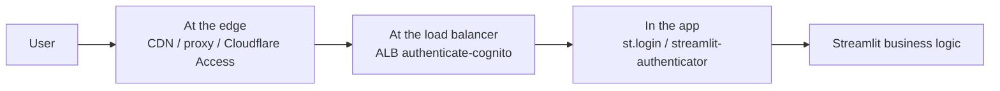

# 3. Authentication and Access Control

This chapter is shared across all deployment approaches. It covers
*how a user proves who they are before the Streamlit app loads*, what
the app then knows about them, and what to do if Okta is not yet
available.

The earlier requirement, restated:

> Org-wide SSO (Okta preferred). Per-user identity must reach the app
> so future agentic actions can be attributed and audited.
> — [`01-context.md` §1.4.2](./01-context.md#142-authentication-and-access-control)

## 3.1 Patterns considered

There are exactly three places auth can be enforced:



| Pattern                            | Enforced at                       | IdP                | Fits which approach            | Best for                           |
| ---------------------------------- | --------------------------------- | ------------------ | ------------------------------ | ---------------------------------- |
| **P1. Cloudflare Access**          | Edge (Cloudflare)                 | Okta SAML/OIDC, or OTP | (A), (C), (F), works for any HTTPS origin | Same-day demos, stop-gaps |
| **P2. ALB authenticate-cognito → Okta** | AWS load balancer            | Cognito User Pool federated to Okta SAML | (D), (E), (G) | Production-shaped AWS deploys |
| **P2b. CloudFront + Lambda@Edge OIDC → Cognito → Okta** | CloudFront        | Cognito → Okta | (F) — App Runner has no native auth | App Runner kept all-AWS |
| **P3. In-app `st.login` OIDC**     | Streamlit Python process          | Okta OIDC          | Any approach                   | Quick wins, but weakest posture    |
| **P3b. streamlit-authenticator (shared password / YAML)** | App | None (local user list) | Any approach | Stop-gap only when no IdP available |

The matrix below shows which auth pattern pairs with which deployment
approach:

| Deployment ↓ / Auth →    | Cloudflare Access | ALB + Cognito | CF + Lambda@Edge | `st.login` OIDC | Shared password |
| ------------------------ | :---------------: | :-----------: | :--------------: | :-------------: | :-------------: |
| (A) Local + tunnel       |       ✅          |      —        |        —         |        ⚠️       |       ⚠️        |
| (B) Streamlit Cloud      |       —           |      —        |        —         |        ✅       |       ⚠️        |
| (C) PaaS                 |       ✅          |      —        |        —         |        ⚠️       |       ⚠️        |
| (D) EC2 behind ALB       |       ⚠️          |      ✅       |        —         |        ⚠️       |       —         |
| (E) Beanstalk            |       ⚠️          |      ✅       |        —         |        ⚠️       |       —         |
| (F) App Runner           |       ✅          |      —        |        ✅        |        ⚠️       |       ⚠️        |
| (G) ECS Fargate + ALB    |       ⚠️          |      ✅       |        —         |        ⚠️       |       —         |

✅ recommended, ⚠️ possible but inferior, — not applicable.

## 3.2 Recommended: ALB authenticate-cognito → Okta SAML

This is the canonical pattern and the recommendation for any
ALB-fronted approach (D, E, G).

### 3.2.1 Flow

```mermaid
sequenceDiagram
    participant U as User browser
    participant ALB as ALB
    participant COG as Cognito User Pool
    participant OKTA as Okta
    participant APP as Streamlit task

    U->>ALB: GET / (no session cookie)
    ALB->>U: 302 → Cognito hosted UI
    U->>COG: GET /login
    COG->>U: 302 → Okta SAML SSO
    U->>OKTA: SAML AuthnRequest
    OKTA->>U: 302 → Cognito ACS with SAMLResponse
    U->>COG: POST /saml2/idpresponse
    COG->>U: 302 → ALB /oauth2/idpresponse?code=...
    U->>ALB: GET /oauth2/idpresponse?code=...
    ALB->>COG: token exchange
    ALB-->>U: Set AWSELBAuthSessionCookie; 302 → /
    U->>ALB: GET / (with cookie)
    ALB->>APP: GET / + x-amzn-oidc-data header
    APP-->>U: Streamlit UI
```

### 3.2.2 Cognito User Pool config

- **Domain**: `rag-demo.auth.us-east-1.amazoncognito.com`
- **Sign-in options**: SAML / external IdP only (disable local
  username/password to force Okta).
- **Attributes mapped from SAML**:
  - `email` ← `http://schemas.xmlsoap.org/ws/2005/05/identity/claims/emailaddress`
  - `given_name` ← `http://schemas.xmlsoap.org/ws/2005/05/identity/claims/givenname`
  - `family_name` ← `http://schemas.xmlsoap.org/ws/2005/05/identity/claims/surname`
- **App client (for ALB)**:
  - Type: confidential (with secret)
  - Allowed callback URL:
    `https://rag-demo.corp.example.com/oauth2/idpresponse`
  - Allowed logout URL: `https://rag-demo.corp.example.com/`
  - OAuth flows: `Authorization code grant`
  - OAuth scopes: `openid email profile`
  - Identity providers: just the Okta SAML IdP (no `COGNITO`)

### 3.2.3 Okta side

- Create a **SAML 2.0** application (Applications → Browse App Catalog
  → "AWS Cognito" template, or generic SAML 2.0).
- Single sign-on URL (ACS): `https://rag-demo.auth.us-east-1.amazoncognito.com/saml2/idpresponse`
- Audience URI (SP Entity ID): `urn:amazon:cognito:sp:<user-pool-id>`
- Name ID format: `EmailAddress`
- Attribute statements: `email`, `given_name`, `family_name`.
- Assign to a group like `RAG Demo Users` — only this group can log in.

Export the Okta IdP metadata XML, paste its URL into the Cognito SAML
IdP config. Cognito will refresh signing keys from the URL.

### 3.2.4 ALB listener rule

Single HTTPS:443 listener, default action with two ordered actions:

1. `authenticate-cognito`
   - `UserPoolArn`, `UserPoolClientId`, `UserPoolDomain`
   - `OnUnauthenticatedRequest = authenticate`
   - `Scope = openid email profile`
   - `SessionTimeout = 28800` (8 h)
2. `forward` to the target group

The ALB sets `AWSELBAuthSessionCookie-*` (split across multiple
cookies if large) on success.

### 3.2.5 Reading the user inside Streamlit

The ALB adds:

- `x-amzn-oidc-data` (JWT, ES256-signed by ALB)
- `x-amzn-oidc-identity` (subject)
- `x-amzn-oidc-accesstoken` (Cognito access token)

Validate `x-amzn-oidc-data` using the ALB public key for the `kid` in
the header, fetched from `https://public-keys.auth.elb.<region>.amazonaws.com/<kid>`.
See the Streamlit snippet in
[`02-approaches/ecs-fargate.md` §G.4](./02-approaches/ecs-fargate.md#g4-streamlit--alb-cognito-header-plumbing).

A small Streamlit middleware caches the decoded claims in
`st.session_state` and exposes `current_user()` to the rest of the
code. Future agentic actions stamp the user's email into Bedrock /
custom-action audit logs.

### 3.2.6 Logout

Cognito hosted UI exposes
`https://<domain>/logout?client_id=<id>&logout_uri=https://rag-demo.corp.example.com/`.
A "Sign out" button in the Streamlit sidebar redirects there; ALB
clears the session cookie on the next request.

## 3.3 Cloudflare Access (recommended for App Runner / non-ALB)

When the deployment does not put an ALB in the path (Approaches A, C,
F), Cloudflare Access is the lowest-friction way to bolt SSO on.

### 3.3.1 Flow

```mermaid
sequenceDiagram
    participant U as User browser
    participant CF as Cloudflare Edge (Access)
    participant OKTA as Okta
    participant APP as Origin (App Runner / tunnel / PaaS)

    U->>CF: GET https://rag-demo.corp.example.com
    CF->>U: 302 → Access login
    U->>OKTA: SAML/OIDC AuthN
    OKTA->>U: 302 → CF callback with assertion
    U->>CF: POST callback
    CF-->>U: Set CF_Authorization cookie; 302 → /
    U->>CF: GET / (cookie)
    CF->>APP: GET / + CF-Access-Jwt-Assertion header
    APP-->>U: Streamlit UI
```

### 3.3.2 Setup

1. Add `corp.example.com` to Cloudflare (or use an existing zone).
2. Cloudflare Zero Trust → **Access → Applications → Add an
   application → Self-hosted**.
3. Application domain: `rag-demo.corp.example.com`.
4. Identity provider: Okta (SAML or OIDC). Cloudflare provides the
   ACS / redirect URIs; Okta admin creates the matching app.
5. Policy: `Allow` if `email ends with @corp.example.com` AND
   `groups includes RAG-Demo-Users`.
6. Origin: CNAME or Cloudflare Tunnel to whatever is running the app.
7. App reads `Cf-Access-Authenticated-User-Email` header (or
   validates `CF-Access-Jwt-Assertion` for production).

### 3.3.3 Trade-offs vs. ALB-Cognito

| Dimension                       | Cloudflare Access            | ALB + Cognito                  |
| ------------------------------- | ---------------------------- | ------------------------------ |
| Setup time                      | ~30 min                      | ~half-day (Terraform)          |
| All-AWS data plane              | no (CF is in the path)       | yes                            |
| Cost (≤ 50 users)               | $0                           | $0 Cognito + ALB cost          |
| Identity to app                 | header + signed JWT          | signed JWT in `x-amzn-oidc-data` |
| Works without an ALB            | yes                          | no                             |
| Sniffs internal traffic         | yes — CF terminates TLS      | no — AWS terminates TLS        |
| Easy to remove later            | yes                          | yes                            |

For an internal-docs RAG bot, Cloudflare seeing the TLS in transit
*may* be acceptable (the answers are internal docs, not regulated
data). Some orgs forbid third-party TLS termination — check before
adopting.

## 3.4 CloudFront + Lambda@Edge OIDC (all-AWS App Runner auth)

If Cloudflare Access is unacceptable and Approach (F) App Runner is
chosen, the all-AWS auth path is:

```mermaid
flowchart LR
    U[User] -->|HTTPS| CFD[CloudFront distribution<br/>custom domain + ACM]
    CFD -->|viewer-request| LE[Lambda@Edge<br/>OIDC handler]
    LE -->|redirect| COG[Cognito Hosted UI]
    COG --> OKTA[Okta SAML]
    OKTA --> COG --> LE --> CFD
    CFD -->|origin: App Runner| AR[App Runner service<br/>private ingress]
```

- Use the open-source pattern from
  `awslabs/aws-cloudfront-extensions` (`auth@edge`) or a small custom
  Lambda@Edge that exchanges the Cognito code for a session cookie
  and validates it on each request.
- App Runner ingress is set to **private** (VPC ingress endpoint), so
  the only path to the origin is through CloudFront → PrivateLink.
- Session cookie signed by Lambda@Edge with KMS, validated on every
  viewer-request invocation.

Cost adder: CloudFront (negligible at demo scale) + Lambda@Edge
invocations (~$0.60/million requests + ~$0.0000125/GB-sec compute,
also negligible).

Operational adder: Lambda@Edge updates take ~10 minutes to propagate
globally; iterating the auth logic during the demo is slower than the
ALB-Cognito path. Build it once and leave it alone.

## 3.5 In-app `st.login` (Streamlit-native OIDC)

Streamlit ≥ 1.42 exposes `st.login(provider)` for OIDC. Config in
`.streamlit/secrets.toml` (or env-mapped equivalent):

```toml
[auth]
redirect_uri = "https://rag-demo.corp.example.com/oauth2callback"
cookie_secret = "<32+ random bytes>"

[auth.okta]
client_id = "..."
client_secret = "..."
server_metadata_url = "https://<org>.okta.com/.well-known/openid-configuration"
```

App code:

```python
if not st.user.is_logged_in:
    st.login("okta")
    st.stop()

st.write(f"Hello, {st.user.email}")
```

**Posture trade-offs vs. enforcement at edge/LB:**

- Pro: Works on *any* deployment, including Streamlit Community Cloud,
  PaaS, and App Runner without a CDN.
- Pro: Identity is structured (`st.user.*`), no header parsing.
- Con: The app must be reachable unauthenticated on at least the
  callback URL. Any route the developer forgets to gate
  (`st.session_state` manipulations, internal pages) leaks.
- Con: A bug in the app can bypass auth. Edge/LB enforcement cannot
  be bypassed by app bugs.
- Con: `cookie_secret` rotation is on you.

Acceptable for the demo when paired with one of the production-shaped
options — it gets identity into the app *in addition to* edge/LB
enforcement, for defense in depth.

## 3.6 Stop-gaps for when Okta is not yet available

In rough order of preference:

1. **Cloudflare Access "One-time PIN" policy** scoped to
   `@corp.example.com`. Users enter their corporate email, receive a
   6-digit code, log in. No Okta required. Reasonable for a 1–2 week
   window. Migrate to Okta by swapping the IdP in the same Access app.
2. **Cognito User Pool with self-registration disabled** and admins
   create users by email. Fine for ALB approaches; users get a
   temporary password from Cognito and reset it on first login.
3. **`streamlit-authenticator` with a YAML user list** (bcrypt-hashed
   passwords, no SSO). Acceptable only for a tiny test group; bad
   posture, hard to revoke.
4. **Shared password.** Avoid. If you must — short rotation cadence,
   never write it in any document checked into git, communicate it
   out-of-band.

## 3.7 Identity → app → AWS audit chain

For future agentic flows, the goal is:

```
Okta user  →  ALB/CF auth  →  Streamlit (current_user())
                             →  boto3 call with session tag
                             →  Bedrock / Bedrock Agent
                             →  CloudTrail event with sourceIdentity
```

The mechanism is **STS `AssumeRole` with `SessionTags` and
`SourceIdentity`** — when the app needs to call a sensitive API on
behalf of a user, it assumes a downstream role and passes the user's
email as `SourceIdentity`. CloudTrail records the source identity on
every subsequent call. This is out of scope for the demo deployment
but worth keeping the path open by ensuring the user identity is
*available* to the app from day one — which every recommended
pattern above guarantees.
