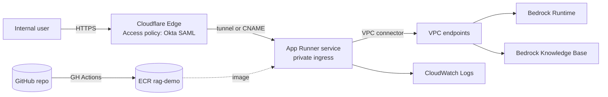
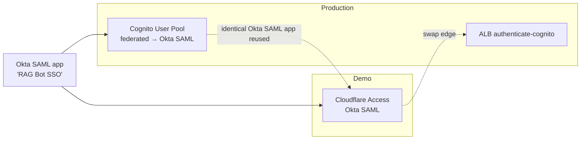

# 5. Recommendation

## 5.1 The pick

**For the demo: Approach (F) AWS App Runner**, fronted by
**Cloudflare Access (Okta SAML)** for authentication, with the
container's outbound traffic routed through a **VPC connector** to
**VPC endpoints** for Bedrock.

Within the same AWS account and Terraform repo, lay the groundwork for
**Approach (G) ECS Fargate + ALB + Cognito-Okta** as the production
target. The Dockerfile, image, IAM policies, and KB integration code
are 100% identical between (F) and (G), so the migration is "swap the
service definition".



## 5.2 Why this combination

Walking the decision drivers from
[`01-context.md` §1.5](./01-context.md#15-decision-drivers-ranked):

1. **Security posture.** App Runner instance role gives the workload
   short-lived AWS credentials with no static key anywhere. VPC
   connector + endpoints keep Bedrock traffic on the AWS backbone.
   Cloudflare Access enforces Okta SSO at the edge before any byte
   touches AWS.
2. **Future fit.** The same image, image-build pipeline, IAM role, KB
   client code, and `current_user()` plumbing transfer unchanged to
   ECS Fargate + ALB when (a) the user count exceeds App Runner's
   sweet spot, (b) the 120 s per-request cap becomes painful, or (c)
   the org standardizes on ALB-Cognito for SSO.
3. **Time to first user.** Roughly 0.5–1 engineer-day to a working
   authenticated URL. Faster than (G), only marginally slower than (A)
   with vastly better posture.
4. **Operational simplicity.** No ALB, ASG, task definitions, or
   target groups to manage. `aws apprunner pause-service` over the
   weekend.
5. **Cost.** ~$40/mo hosting, paused over weekends drops it further.

Cloudflare Access is chosen over a CloudFront + Lambda@Edge auth
because it is dramatically faster to set up, gives the same identity
guarantees to the app via a signed header, and is easy to remove
later. The trade-off (Cloudflare terminates TLS on the path) is
explicitly noted in §5.5 below.

## 5.3 What "lay the groundwork for production" means

Write the demo's Terraform such that promoting to (G) is a config
change, not a rewrite:

```
infra/
  modules/
    network/              # VPC, subnets, endpoints   ← reused as-is
    cognito_okta/         # user pool + Okta IdP      ← built now, used by ALB later
    ecr_repo/             #                           ← reused as-is
    app_runner_service/   # used in demo
    ecs_service/          # used in prod (later)
    alb_cognito/          # built later
  envs/
    demo/
      main.tf             # composes: network + ecr + app_runner_service + (CF Access out of TF)
    prod/                 # not built now; placeholder
      main.tf             # composes: network + ecr + ecs_service + alb_cognito + cognito_okta
```

Build `network/`, `ecr_repo/`, and `app_runner_service/` now. Build
`cognito_okta/` now even though the demo uses Cloudflare Access —
having a working Cognito + Okta SAML pool before prod removes a long
pole from the production launch.

## 5.4 Auth migration path



The Okta SAML application created for Cloudflare Access can be reused
when Cognito is wired up — Okta just needs to add the Cognito ACS URL
as a second SP. No new Okta admin work.

## 5.5 Explicit trade-offs accepted

By picking (F) + Cloudflare Access we are accepting:

1. **Cloudflare terminates TLS** for `rag-demo.corp.example.com`.
   Internal documentation contents pass through Cloudflare's edge in
   plaintext (within Cloudflare's infra). For *this* RAG bot
   answering internal-docs questions, the security review judgment is
   that this is acceptable for a multi-week demo. If the org has a
   policy against third-party TLS termination, switch to
   CloudFront + Lambda@Edge auth (§3.4) before launch.
2. **App Runner per-request timeout of 120 s.** Streamlit's WS
   transport masks this for ordinary chat turns. Long agentic flows
   must stream incremental updates, which is how Streamlit naturally
   works. Validate end-to-end with a synthetic 60 s and 200 s task
   before user testing.
3. **Single replica.** Streamlit holds per-user state in process
   memory. With one App Runner instance there is no cross-replica
   session loss, but if the instance is replaced (during a deploy)
   every connected user's chat history resets. Acceptable for the
   demo; flagged for the production design.
4. **Cognito User Pool built now, used later.** Cost of doing this:
   ~30 min and $0/mo at < 50 MAU. Reward: production-ready auth
   already configured, Okta admin only touched once.

## 5.6 Concrete demo build plan

Sequenced as a checklist. Each item is roughly 1–3 hours.

1. **Repo prep**
   - Add `Dockerfile`, `.dockerignore`, `requirements.txt` pinned.
   - Add `app.py` `current_user()` helper that reads
     `Cf-Access-Jwt-Assertion` (Cloudflare) and falls back to
     `x-amzn-oidc-data` (so the same code works on ECS later).
   - Add a `make build` target.
2. **AWS account prep**
   - Confirm Bedrock model access (Anthropic Claude Sonnet) in the
     target region.
   - Confirm the Knowledge Base ID and its source data.
3. **Terraform: `network/` module**
   - VPC, 2 private subnets, 5 VPC endpoints (bedrock-runtime,
     bedrock-agent-runtime, ecr.api, ecr.dkr, logs), 1 gateway
     endpoint (s3).
4. **Terraform: `ecr_repo/`**
   - Repository `rag-demo`, image-tag-immutability ON, scan on push.
5. **Build & push image** to ECR (`0.1.0` tag).
6. **Terraform: `app_runner_service/`**
   - Instance role with Bedrock + KB policy.
   - VPC connector pointing at the network module's private subnets.
   - Service with `IsPubliclyAccessible: true` (Cloudflare in front),
     `AutoDeploymentsEnabled: true`, health check on
     `/_stcore/health`.
7. **Custom domain on App Runner**
   - Create `rag-demo.corp.example.com` as a custom domain on the App
     Runner service; AWS issues a certificate; add the validation
     CNAMEs to DNS.
8. **Terraform: `cognito_okta/`** (not used in front of the demo, but
   built now for prod)
   - User pool, domain, SAML IdP wired to Okta metadata URL,
     attribute mappings, app client. Track the user pool ARN as an
     output.
9. **Okta admin work** (one ticket)
   - Create SAML app `RAG Bot SSO`.
   - ACS A: Cloudflare Access ACS URL.
   - ACS B: Cognito ACS URL (added at the same time so Okta is
     touched once).
   - Assign group `RAG Demo Users`.
10. **Cloudflare Access**
    - Add `corp.example.com` zone if not present.
    - CNAME `rag-demo.corp.example.com` → App Runner default
      hostname.
    - Cloudflare Access app: Okta SAML, policy = group membership +
      email domain.
11. **End-to-end test**
    - From a colleague's laptop on the corp network.
    - From a colleague's laptop *off* the corp network (SSO should
      still work).
    - With Okta MFA enforced.
    - With a long synthetic answer (≈ 90 s of streaming) to validate
      WS through Cloudflare → App Runner.
12. **Cost controls**
    - AWS Budget at $300/mo with 80% and 100% alerts.
    - Per-user message-rate guard in the app (e.g. 30 messages /
      user / hour) so a runaway script can't burn Bedrock budget.
13. **Feedback loop**
    - In-app feedback widget (thumbs up/down + free text) writing to
      a DynamoDB table or S3 file. Keyed by `current_user().email`.
14. **Pause schedule**
    - `aws apprunner pause-service` on a nightly EventBridge schedule
      (resume in morning) to cut hosting cost further.

## 5.7 Exit criteria for the demo

The demo is "done" — feedback collected, production design unblocked
— when *all* of these are true:

- ≥ 20 distinct internal users have logged in and asked ≥ 5 questions
  each.
- The in-app feedback table has > 50 ratings.
- A retrospective lists the top 5 model/RAG issues blocking
  production.
- A go/no-go decision is made on (G) ECS Fargate + ALB-Cognito as
  the production architecture.

## 5.8 Tear-down

When the demo ends:

1. `aws apprunner delete-service`.
2. `terraform destroy` of the `demo` env (leaves `network/`,
   `ecr_repo/`, `cognito_okta/` modules in place if those move to a
   `shared/` env).
3. Disable the Cloudflare Access app (keep the config archived).
4. Keep the ECR image — production reuses it as the v0 baseline.
5. Keep the Cognito user pool and Okta SAML app — production reuses
   both.
