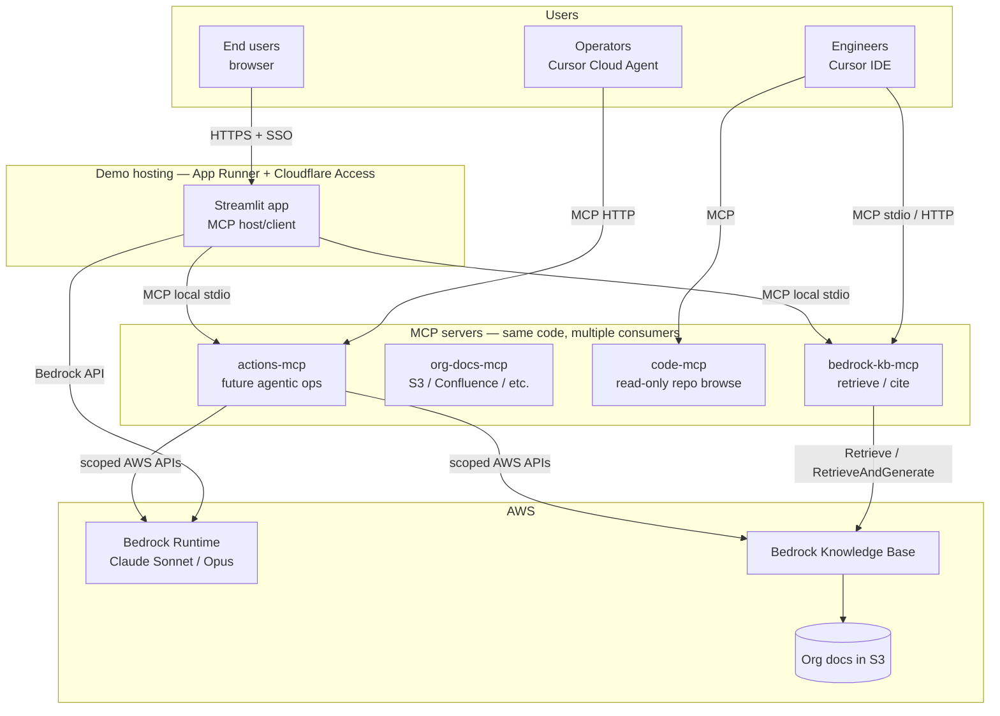
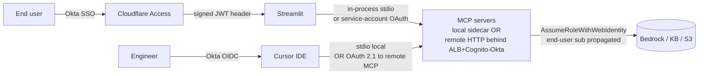

# 6. MCP + Cursor approach

A focused, standalone analysis of whether and how to introduce the
**Model Context Protocol (MCP)** and **Cursor** into the deployment
story for the internal RAG chatbot prototype.

This document complements the broader plan in
`docs/deployment/01-context.md` through `05-recommendation.md`
(approaches A–G, authentication, comparison matrix, recommendation).
Nothing here contradicts that plan — this document either reinforces
the prior recommendation or proposes additive changes that fit on
top of it.

It is written to answer five questions:

1. What does "MCP + Cursor approach" actually mean for this app?
2. What concrete features and design properties does it give us?
3. What does it *not* give us — what is still external?
4. Is it a fit for the **demo**? For **production**? For the
   **future agentic features** the prototype's owner wants to add?
5. What is verifiably known versus inferred or time-bounded?

Section 9 collects the things I am explicitly **not** certain about,
to honour the "no hallucinations or assumptions" requirement.

---

## 6.1 Disambiguating "MCP + Cursor"

"MCP + Cursor" is not a single thing. There are at least three
distinct readings, and the right answer depends on which one is
meant. They are not mutually exclusive.

| # | Reading | What it actually means | Adds to the demo? |
|---|---|---|---|
| R1 | **MCP as the app's tool/integration layer** | Refactor Bedrock Knowledge Base (KB) access, future agentic actions, and codebase access into MCP servers. The Streamlit app becomes one MCP client/host; other clients (Cursor IDE, Claude Desktop, future agents) can reuse the same servers. | Optional, additive |
| R2 | **Cursor as a developer/operator client surface** | Engineers and ops use Cursor IDE (and Cursor Cloud Agents) as one of the MCP clients above, so they can run agentic actions against the same KBs and codebases without going through Streamlit. | Optional, additive |
| R3 | **Cursor as the deployment/automation control plane** | Use Cursor Cloud Agents to write infra, push images, and operate the AWS deployment, optionally using AWS-published MCP servers for AWS API access (e.g. `awslabs/mcp`). | Optional, replaces or augments CI/CD |

Crucially, none of R1/R2/R3 replaces the hosting decision in
`05-recommendation.md`. The Streamlit demo still has to run somewhere
end users can reach. **MCP and Cursor do not host end-user-facing
Streamlit traffic.**

> If "deploy via MCP + Cursor" is read as "deploy the app *to* MCP
> + Cursor instead of AWS" — that is not a thing MCP or Cursor offer.
> Both are a protocol and a developer tool respectively, not
> application hosts. The honest framing is: keep the hosting
> decision (App Runner + Cloudflare Access), and *add* MCP + Cursor
> as a tool/agent layer on top.

The rest of this document treats "MCP + Cursor approach" as the
combination of R1 + R2 (architecture + dev-surface), with R3
mentioned where relevant.

---

## 6.2 Reference architecture (proposed)



The defining property is: **one set of MCP servers, many clients**.
The Streamlit app is just another client. Cursor and any future
agent are also clients of the same servers. This is the property
that makes adopting MCP early worthwhile even when the demo could
be shipped without it.

---

## 6.3 What MCP gives us (features and design properties)

Stated as concrete properties, not marketing claims. The protocol is
documented at `modelcontextprotocol.io`; the items below are
properties of the protocol itself, not of any particular server.

### 6.3.1 A typed tool boundary

MCP servers expose three primitives:

- **Tools** — callable functions with JSON-Schema inputs/outputs,
  intended to be model-invoked.
- **Resources** — URI-addressable read-only context, intended to be
  app-controlled.
- **Prompts** — named, parameterized prompt templates, intended to
  be user-controlled.

For this app, concrete instances:

- *Tool*: `retrieve(kb_id, query, top_k)` → list of passages with
  citation metadata.
- *Tool*: `retrieve_and_generate(kb_id, query, model_arn, top_k)` →
  answer + citations (mirrors the Bedrock KB API).
- *Resource*: `s3://docs-bucket/<path>` → document body.
- *Prompt*: `cite_with_sources` → a system prompt template reused
  by Streamlit, Cursor, and future agents when summarising.

The boundary is **typed and discoverable** — clients call
`tools/list`, `resources/list`, `prompts/list` and get schemas back.
This is the property that makes MCP servers reusable across clients
without bespoke integration.

### 6.3.2 Two transports, well-defined

- **stdio** — server is a subprocess of the client; messages framed
  over stdin/stdout. Local-only, trivial to ship inside the same
  container as Streamlit.
- **Streamable HTTP** — server is a network endpoint. Required when
  the server must outlive any one client, or be shared across
  clients (the case here: Streamlit + Cursor + future agents).

> A predecessor HTTP+SSE transport existed in earlier revisions of
> the spec and has been superseded by Streamable HTTP. Some older
> servers and clients still implement only the older transport;
> compatibility is per-pair. See §6.9.

For the demo: stdio is enough if Streamlit is the only client. The
moment we want Cursor IDE on a remote engineer's laptop to call
`retrieve(...)` against the org's KB, we need HTTP. The approach in
§6.7 starts with stdio and earns the right to HTTP later.

### 6.3.3 Auth model

The current MCP spec defines an **OAuth 2.1 + PKCE** flow for HTTP
transports, with the MCP server playing the role of an OAuth
resource server. Authorization Server metadata discovery and
audience-bound bearer tokens are part of the spec.

In practice for an org on Okta: stand the MCP servers up behind an
**OIDC-protected gateway** (ALB + Cognito-Okta, or a small reverse
proxy doing OIDC). The MCP server itself validates the bearer
token's audience and `sub`, and uses the `sub` to derive an AWS role
via `AssumeRoleWithWebIdentity`. This preserves end-user identity
all the way to Bedrock + S3.

> Caveat (§6.9 #2, #4): not every MCP client implements the full
> OAuth 2.1 dance today, and Cognito User Pools have quirks around
> OAuth resource indicators. For the demo, the simpler model —
> Cloudflare Access in front of the MCP HTTP endpoint, issuing a
> service-account token to the Streamlit caller — is more reliable
> than full per-user OAuth across heterogeneous clients.

### 6.3.4 Sampling (server → client LLM calls)

MCP allows a server to request an LLM completion from the client
("sampling"). For agentic workflows this is the property that lets a
tool-side multi-step plan reuse the client's chosen model and quota
rather than carrying its own credentials. **Not all clients
implement sampling.** For this app the safe default is: tools do not
rely on sampling for the demo; agentic loops live in
Streamlit/Bedrock and call tools as needed.

### 6.3.5 Roots and resource scoping

The client declares "roots" — filesystem/URL boundaries within which
a server may read. For Cursor users browsing the repo this is the
normal mechanism. For a remote MCP server (KB retrieval) roots are
less relevant; scoping is enforced server-side in tool implementation.

### 6.3.6 Server reusability — the single largest pragmatic win

Write `bedrock-kb-mcp` once, consume from:

- Streamlit (the demo),
- Cursor IDE (engineer queries),
- Cursor Cloud Agents (operations and triage),
- Claude Desktop or any other MCP host (ad-hoc),
- a future LangGraph / custom agent runner,
- a future Bedrock Agent action group (wrapped to call MCP).

Without MCP, each of those is a bespoke integration against the same
boto3 surface. With MCP, it's `tools/list` and go.

### 6.3.7 Observability

Each tool call is a discrete protocol event with a method name,
arguments, and a typed result. This makes per-tool, per-user,
per-call structured logging trivial at the MCP server boundary, in a
place neither Streamlit nor boto3 naturally provide. Useful for the
audit story production will need.

---

## 6.4 What Cursor adds (features and design properties)

Cursor is the IDE and agent platform; the items below are properties
of Cursor as it interacts with MCP.

### 6.4.1 Cursor IDE as an MCP client

Configured via `.cursor/mcp.json` at the repo root (per-project) or
at `~/.cursor/mcp.json` (global). Supports stdio and HTTP transports.
Tools listed by the server appear in the IDE's tool palette; the IDE
prompts for approval before invoking, per the user's configured
auto-run policy.

This gives engineers immediate agentic access to the KB and codebase
tools without leaving the IDE — exactly the "perform any and all
permissible agentic actions on KBs and codebases" use case the
prototype's owner described.

A minimal `.cursor/mcp.json` for this repo, using a local stdio
server, looks like:

```json
{
  "mcpServers": {
    "bedrock-kb": {
      "command": "python",
      "args": ["-m", "rag_demo.mcp.bedrock_kb_server"],
      "env": {
        "AWS_REGION": "us-east-1",
        "BEDROCK_KB_ID": "${BEDROCK_KB_ID}"
      }
    }
  }
}
```

(The engineer's own AWS credentials, picked up via the default boto3
chain, are used for the local server invocation. No shared secrets
in the repo.)

### 6.4.2 Cursor Cloud / Background Agents

LLM-driven agents that run autonomously against a repo. In the
shape this current task is running in: they can read/write files,
run shell commands, push branches, and open PRs.

Concrete uses for the demo, in increasing order of ambition:

- Maintain the Terraform for the App Runner deployment from issue
  descriptions.
- Roll a new image and update the App Runner service when the
  prototype is changed.
- Run a nightly evaluation pass over a fixed Q&A set and file an
  issue if regressions appear.
- Triage user feedback collected in DynamoDB into GitHub issues with
  reproduction details and tag candidates.

When MCP servers are configured for the repo, those agents can use
them too — extending the "one server, many clients" property to
operations.

> Caveat (§6.9 #3): Cursor Cloud Agents are a developer-productivity
> surface, not a load-balanced production runtime. Treat them as "an
> SRE who can be paged and works through PRs," not as "the app's
> runtime."

### 6.4.3 What Cursor is *not*

To be unambiguous:

- Not a hosting platform for the Streamlit app.
- Not an org-wide SSO front-door for non-developer end users.
- Not a long-running server process. Cursor Cloud Agent runs are
  bounded invocations.
- Not a substitute for the hosting + authentication chapters in
  `02-approaches/` and `03-authentication.md`.

---

## 6.5 Authentication composition

This is the section to pay attention to, because it is where MCP,
Cursor, Okta, and AWS interact.



Two identity edges:

- **End user → Streamlit → MCP**. Cloudflare Access (Okta SAML) at
  the Streamlit edge gives Streamlit a signed identity (header
  `Cf-Access-Jwt-Assertion`, signed by Cloudflare's per-team
  keypair, asserting the end-user's email and `sub`). Streamlit
  calls the MCP server with the end-user `sub` propagated. If the
  server is in-process stdio (the demo's recommended shape), no
  network auth is required. If remote, Streamlit authenticates as a
  service account and passes the end-user `sub` in a request header
  that the MCP server validates as coming from a trusted upstream.
  On the AWS side, the MCP server performs
  `AssumeRoleWithWebIdentity` with the user's OIDC token to preserve
  per-user IAM context.

- **Engineer → Cursor → MCP**. Engineer SSOs into Cursor via Okta;
  Cursor connects to MCP either locally (stdio, engineer's own AWS
  credentials) or remotely (OAuth 2.1 PKCE against the remote MCP
  endpoint where supported). AWS context is derived the same way as
  for end users.

This gives a **single identity model** for the demo and for
production, regardless of which client is calling — but only when
the MCP server is remote. For the demo, the stdio shape avoids the
auth complexity entirely (§6.7.2).

---

## 6.6 Detailed feature/design characteristics

| Property | Without MCP+Cursor | With MCP+Cursor (Option β, §6.7.2) |
|---|---|---|
| **Tool reuse across clients** | Each new client re-implements KB retrieval against boto3. | One server; N clients. |
| **Schema typing** | Implicit, in Python. | JSON-Schema per tool, discoverable. |
| **Auth surface** | Streamlit-only (Cloudflare Access). | Same — MCP server is in-process; no new auth surface. |
| **End-user identity → AWS** | Header-based, app-specific. | Same. (Becomes "standardized at the MCP boundary" in Option γ.) |
| **Developer agentic access to KBs** | None today. | Cursor IDE calls `retrieve(...)` directly against local AWS creds. |
| **Operational agentic actions** | Hand-written scripts. | Cursor Cloud Agent + actions-MCP server. |
| **Audit logging** | Streamlit logs + AWS CloudTrail. | + MCP server access logs (per-tool, per-user, per-call), structured. |
| **Latency overhead** | Streamlit → boto3 → AWS. | Streamlit → in-process MCP → boto3 → AWS. Sub-millisecond overhead in-process. |
| **Failure modes** | Outage on Bedrock errors. | Identical — MCP server in same process as Streamlit. |
| **Deployment surface** | 1 container. | 1 container (Streamlit + MCP sidecar in-process). |
| **Spec-evolution risk** | None — boto3 is stable. | MCP spec evolves; pin a spec version per server. |
| **Client ecosystem** | Browser only. | + Cursor IDE, + Cursor Cloud Agents, + any future MCP host. |

Option γ (remote MCP from day one) shifts several rows: auth surface
grows to include the MCP gateway, latency grows by one network hop
(~5–20 ms intra-region), failure modes grow to include MCP-server
outage independent of Streamlit, and deployment surface grows to 1+N
services. The benefit is end-user identity passing cleanly through
to AWS via OAuth 2.1 from any client.

---

## 6.7 Concrete options for the demo

Three configurations, in increasing order of MCP+Cursor adoption.

### 6.7.1 Option α — No MCP at runtime; Cursor only for ops

- Ship the demo exactly as `05-recommendation.md` proposes.
- Use Cursor Cloud Agents to maintain Terraform and the image
  pipeline. Optionally configure `.cursor/mcp.json` to use
  AWS-published MCP servers (the public `awslabs/mcp` repository)
  for AWS API access from the agent, instead of naked boto3 / aws
  CLI calls inside shell tools.
- **No runtime change to the app.**
- Cost of adoption: near zero — just commit `.cursor/mcp.json`.
- Future fit: low. Streamlit and any future agent still each
  re-implement KB access; the integration savings of MCP are not
  realised.

### 6.7.2 Option β — Local MCP sidecar (recommended for the demo)

- Ship the existing Streamlit container with a **stdio MCP server**
  process (`bedrock-kb-mcp`) that wraps the Bedrock KB calls
  already used by Streamlit. The Streamlit app calls it via an
  in-process MCP client.
- Same container, same hosting (App Runner), same auth (Cloudflare
  Access). No new network surface, no new IAM role.
- Engineers using Cursor IDE point at a **second instance** of the
  same MCP server running locally on their laptop (stdio), with
  their own AWS credentials. No remote MCP endpoint exposed yet.
- Establishes the MCP boundary internally without taking on the
  operational cost of a remote, OAuth-protected MCP server.
- Cost of adoption: roughly 1–2 engineer-days to author the MCP
  server wrapping the existing KB code (concrete delta in §6.10).
- Future fit: high. When production moves to ECS Fargate (the path
  laid out in §5.3 of the prior plan), the same MCP server is
  promoted to a separate Fargate service exposed over Streamable
  HTTP behind ALB + Cognito-Okta. Streamlit and Cursor switch from
  stdio to HTTP without code changes to the server.

### 6.7.3 Option γ — Remote MCP servers from day one

- Stand up `bedrock-kb-mcp`, `org-docs-mcp`, and `actions-mcp` as
  Streamable-HTTP services behind ALB + Cognito-Okta.
- Streamlit, Cursor IDE, and Cursor Cloud Agents all consume them
  remotely.
- This is the production end-state, pulled forward into the demo
  window.
- Cost of adoption: roughly 4–6 engineer-days plus the
  Cognito-Okta work that `05-recommendation.md` defers to the
  production phase.
- Demo risk: higher. Three services to operate, OAuth on each, more
  places for the demo to break in front of internal testers.

### 6.7.4 Recommendation within this chapter

**Option β.** It captures the architectural benefit of MCP (the
typed, reusable tool boundary) without taking on the operational
cost of a remote, OAuth-protected MCP fleet during the demo window.
Cursor IDE usage for engineers comes "for free" because the same
stdio server runs locally with local AWS credentials. Option γ
becomes the natural shape of the production deployment described in
the prior plan when one of the triggers in §6.11 fires.

If the demo timeline is tighter than the 1–2 engineer-day cost of
authoring the MCP server, fall back to Option α; the prior plan
stands without modification, and Option β can be done as a
follow-up before production.

---

## 6.8 Pros and cons (overall)

**Pros**

- One typed tool boundary used by Streamlit, Cursor IDE, Cursor
  Cloud Agents, and any future agentic framework.
- Typed schemas → easier evaluation harness, easier guardrails,
  easier audit.
- Cursor IDE gives the dev team immediate agentic access to KBs and
  the codebase — directly addressing the prototype owner's stated
  goal of "perform any and all permissible agentic actions on KBs
  and codebases."
- Auth model composes cleanly with Okta; no new IdP needed.
- In Option β shape, adoption adds essentially no demo-time risk.
- Migration to production (Option γ) is "promote the stdio server
  to HTTP, put a gateway in front" — not a rewrite.

**Cons / costs**

- Adds one layer of indirection. In Option β this is sub-millisecond
  (in-process); in Option γ it is one extra intra-region network
  hop.
- MCP spec is still evolving; pinning a spec/version per server is
  necessary.
- Remote MCP auth tooling is maturing. Full per-user OAuth across
  all heterogeneous clients is not yet uniformly supported (§6.9).
- Cursor Cloud Agents in operations workflows are good for PR-based
  changes; they are not a substitute for an on-call rotation or
  paged runbooks.
- Adds developer cognitive load: engineers must understand MCP
  basics to extend the tool surface. The flip side is that they
  learn a portable skill, not a project-local API.

---

## 6.9 What I am explicitly *not* certain about

To honour the "no hallucinations or assumptions" requirement, the
time- or environment-bounded claims that should be verified before
committing to design details:

1. **Exact set of AWS-published MCP servers and their current
   feature coverage.** AWS Labs maintains a public `awslabs/mcp`
   repository containing MCP servers, including ones for
   Bedrock-related functionality. The exact server names,
   command-line flags, transport support, and feature coverage may
   have changed; verify against the upstream repository before
   committing to a specific server set or vendoring its config.
2. **Cursor's current MCP feature support.** Cursor supports MCP
   servers via `mcp.json` and supports both stdio and HTTP
   transports. Specifics — remote-HTTP auth flow support, OAuth 2.1
   PKCE handling, sampling support, and the exact set of MCP
   capabilities exposed to Cloud Agents — have changed across
   Cursor versions. Confirm against current Cursor release notes
   and documentation before designing around any specific behaviour.
3. **Cursor Cloud Agent guarantees.** Concurrency, runtime limits,
   network egress policy, secret handling, and whether a given
   agent invocation can be expected to complete a long-running
   operation are operational properties of the Cursor platform that
   may evolve. Treat Cloud Agents as best-effort developer
   automation, not as a critical-path operations runtime, until
   specifically validated.
4. **MCP spec version pinning.** The protocol has had named
   revisions over time; some clients lag the latest by one revision.
   Pin a version per server, and explicitly test the
   Cursor-version ↔ server-version pair before relying on a feature
   like Streamable HTTP, sampling, or OAuth-protected resources.
5. **OAuth 2.1 + Cognito-Okta interplay.** Cognito User Pools speak
   OAuth 2.x-compatible flows but with quirks (limited support for
   some advanced parameters such as resource indicators in older
   pool versions). Validate Cognito's compatibility with the MCP
   server's audience-restricted bearer-token expectations in a
   spike before designing the production auth around it.
6. **Per-user AWS context via the MCP boundary.**
   `AssumeRoleWithWebIdentity` from a Cognito-issued OIDC token is
   a documented and supported AWS path. The detail of doing it
   *per MCP call* — so that the MCP server's downstream AWS calls
   happen under the end user's IAM context, not the server's
   service identity — has rate-limit, latency, and credential-cache
   implications that should be benchmarked, not assumed.
7. **The "right" set of tools to expose.** The minimal set in §6.10
   (retrieval only) is safe. Adding write/mutating tools
   (`actions-mcp`) is a security review item that this document
   does not pretend to scope; it is listed as a future step.

If any of (1)–(6) turns out to differ materially from the assumptions
above, revise Option β toward Option α (less MCP) rather than
forcing the spec into production.

---

## 6.10 Build plan delta over `05-recommendation.md` §5.6

Adding Option β to the existing demo plan. Inserted between steps 5
("Build & push image") and 6 ("Terraform: app_runner_service") of
`05-recommendation.md` §5.6:

- **5a. Author `bedrock-kb-mcp`** — a stdio MCP server wrapping the
  Bedrock KB `Retrieve` and `RetrieveAndGenerate` calls already
  used by Streamlit. Single Python module. Tools:
  - `retrieve(kb_id: str, query: str, top_k: int = 5)` →
    `[{passage, citation_uri, score}, …]`
  - `retrieve_and_generate(kb_id: str, query: str,
    model_arn: str, top_k: int = 5)` →
    `{answer, citations: [...]}`
  JSON-Schema for all inputs and outputs. Server pins a specific
  MCP protocol revision in its declared `serverInfo`.

- **5b. Wire Streamlit to the MCP server via an in-process stdio
  client.** Streamlit chat loop now invokes MCP tools instead of
  calling boto3 KB methods directly. Bedrock LLM calls remain
  direct (Bedrock Runtime stays a boto3 dependency of Streamlit).

- **5c. Add `.cursor/mcp.json`** at the repo root pointing at the
  same `bedrock-kb-mcp` server, runnable locally with the
  engineer's AWS credentials. Smoke test: ask Cursor "what does our
  KB say about X?" from the IDE and confirm it invokes
  `retrieve(...)` and surfaces citations.

- **5d. Container packaging.** The MCP server module ships inside
  the same image as Streamlit; both are started by the container
  entrypoint (Streamlit launches the MCP server as a subprocess
  via the MCP client lib's stdio transport). No new ports exposed,
  no new IAM role.

- **5e. Logging.** Emit MCP-call structured logs (tool name, user
  `sub` from the Cloudflare Access header, latency, error)
  alongside Streamlit logs to CloudWatch. This is the seed of the
  per-tool audit story production will need.

- **5f. (Optional) Cursor Cloud Agent operator runbook.** A one-page
  document describing which `cursor/<branch>` patterns the team
  uses for: image rolls, Terraform changes, evaluation reruns,
  feedback triage. Not required for the demo; useful for ops.

No other steps in `05-recommendation.md` §5.6 change. The container,
the App Runner service, the Cloudflare Access policy, the Okta SAML
app, and the Cognito user pool (built early per §5.3 for the future
production migration) are unchanged.

---

## 6.11 When to promote Option β → Option γ

Promote the stdio sidecar to a remote, OAuth-protected Streamable
HTTP MCP server when **any** of these becomes true:

- A second user-facing app (e.g. a Slack bot) needs the same tools.
- An agent runs out-of-process (e.g. a LangGraph runner on a
  separate Fargate task) and needs to call the tools without
  duplicating the server code.
- Cursor Cloud Agents need to call the tools without each agent
  carrying long-lived AWS credentials.
- The org's audit policy requires per-tool, per-user logs in a
  central place independent of the Streamlit app's lifecycle.
- The set of tools grows beyond retrieval to include
  mutating/agentic actions (`actions-mcp`), at which point a
  separate failure domain and a separate IAM role per server become
  the right shape.

Until at least one of those is true, the local sidecar is the right
shape — additive, low-risk, future-proof.

---

## 6.12 Summary

- **MCP + Cursor is not a deployment target.** It is an
  architectural choice and a developer/operator surface layered on
  top of whatever hosting decision is made. The hosting decision in
  `05-recommendation.md` (App Runner + Cloudflare Access for the
  demo, ECS Fargate + ALB + Cognito-Okta for production) is
  unchanged by anything in this chapter.

- **For deploying the demo**, the existing recommendation stands.
  MCP can be adopted additively as a **local stdio sidecar inside
  the same container** (Option β) with very low incremental risk —
  no new network surface, no new IAM role, no new auth flow.

- **For the future agentic features** the prototype's owner wants
  to add, MCP is a strong fit. Adopting it in Option β shape during
  the demo removes most of the integration cost of moving to a
  multi-client (Streamlit + Cursor + agents + Slack/etc.) world
  later. Promotion to Option γ is a config change to the MCP
  servers and a gateway in front, not a rewrite.

- **Cursor's role** is twofold and bounded: (i) developer client of
  the same MCP servers, giving engineers immediate agentic access
  to KBs and codebases; (ii) operator/automation surface via Cloud
  Agents for repo-driven changes. Neither role is "host the app."

- **Several claims about specific MCP and Cursor feature versions
  are time-bounded;** §6.9 catalogues them. Validate before
  committing detail-level design.
