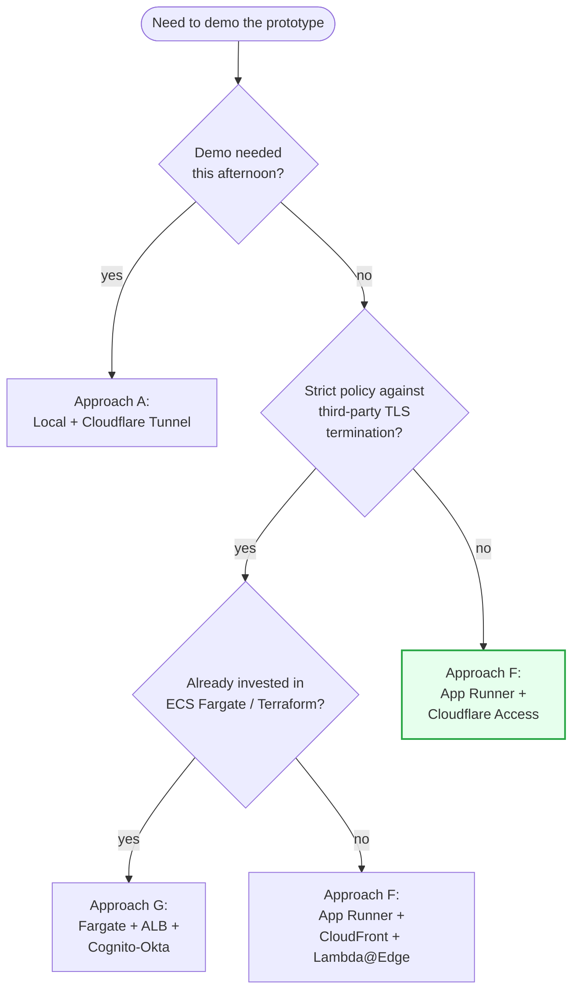

# Deployment Plan — Internal RAG Chatbot Demo

This directory holds the deployment plan for the **internal RAG
chatbot** described in [`01-context.md`](./01-context.md). The plan is
explicitly scoped to **the demo deployment** — putting the existing
Streamlit prototype in front of internal testers — not the production
launch. Production is in scope only inasmuch as the demo must not
foreclose a clean production path.

## Executive summary

- The prototype is a **Streamlit + boto3** app calling **Bedrock
  Claude Sonnet** over a **Bedrock Knowledge Base**, currently running
  on the author's laptop.
- The goal of this deployment is a **multi-week test run with ~10–50
  internal users**, SSO'd via **Okta** (preferred) or a stop-gap.
- Seven deployment approaches were evaluated in detail; three more
  were filtered out as infeasible (Lambda + API Gateway, static
  hosting, Amplify / Vercel / Netlify) because they fail Streamlit's
  long-lived-process + WebSocket requirements.
- The **strongly recommended demo deployment** is
  **AWS App Runner + Cloudflare Access (Okta SAML)**, with the
  groundwork laid for a future move to **ECS Fargate + ALB +
  Cognito-Okta** as the production architecture. Same container,
  same IAM model, same Knowledge Base wiring.
- Estimated hosting cost: **~$40 / month** for the demo window (AWS
  Bedrock usage is separate and dominates total spend regardless of
  deployment choice).
- The full reasoning, including ranked decision drivers, a weighted
  comparison matrix, and a step-by-step build plan, is in
  [`05-recommendation.md`](./05-recommendation.md).

## Table of contents

1. [Context and Requirements](./01-context.md) — what is being
   deployed, who uses it, what must be true.
2. [Deployment Approaches — Index](./02-approaches/README.md) — the
   seven options, each with a one-paragraph summary and a link to the
   detailed write-up:
   - [A. Local laptop + secure tunnel](./02-approaches/local-tunnel.md)
   - [B. Streamlit Community Cloud](./02-approaches/streamlit-community-cloud.md)
   - [C. Third-party PaaS (Render / Fly / HF Spaces)](./02-approaches/third-party-paas.md)
   - [D. AWS EC2 single instance](./02-approaches/ec2.md)
   - [E. AWS Elastic Beanstalk](./02-approaches/elastic-beanstalk.md)
   - [F. AWS App Runner](./02-approaches/app-runner.md)
   - [G. AWS ECS Fargate behind ALB](./02-approaches/ecs-fargate.md)
3. [Authentication and Access Control](./03-authentication.md) — Okta
   integration patterns (Cloudflare Access, ALB + Cognito,
   CloudFront + Lambda@Edge, in-app `st.login`) and stop-gaps.
4. [Comparison Matrix](./04-comparison-matrix.md) — weighted scoring,
   feature matrix, cost, effort, risk register.
5. [Recommendation](./05-recommendation.md) — the pick, the why, the
   migration path to production, and the concrete demo build plan.

## How to read this set

If you have 5 minutes: read the [Executive summary](#executive-summary)
above and §5.1 in [`05-recommendation.md`](./05-recommendation.md).

If you have 30 minutes: read this README, then
[`01-context.md`](./01-context.md), then
[`04-comparison-matrix.md`](./04-comparison-matrix.md), then
[`05-recommendation.md`](./05-recommendation.md).

If you are about to do the build: read everything, then work from
[`05-recommendation.md` §5.6](./05-recommendation.md#56-concrete-demo-build-plan).

If you want to challenge the recommendation: read
[`01-context.md` §1.5](./01-context.md#15-decision-drivers-ranked) for
the decision drivers and weights, then
[`04-comparison-matrix.md`](./04-comparison-matrix.md) for the
scoring. If the drivers or weights are wrong for the org, the answer
will change.

## What this plan does *not* cover

Explicitly out of scope (already listed in
[`01-context.md` §1.6](./01-context.md#16-out-of-scope-for-this-document)):

- Production multi-region / DR strategy
- Canonical CI/CD pipeline design (sketches per approach only)
- Bedrock Knowledge Base ingestion pipeline
- Evaluation / guardrails framework
- Bedrock cost optimisation (prompt caching, model routing)
- Choice of agentic framework (Bedrock Agents vs. LangGraph vs. custom)

Each of these is a follow-on document, written *after* the demo is
live and producing feedback.

## High-level decision diagram

(Green = primary recommendation.)
